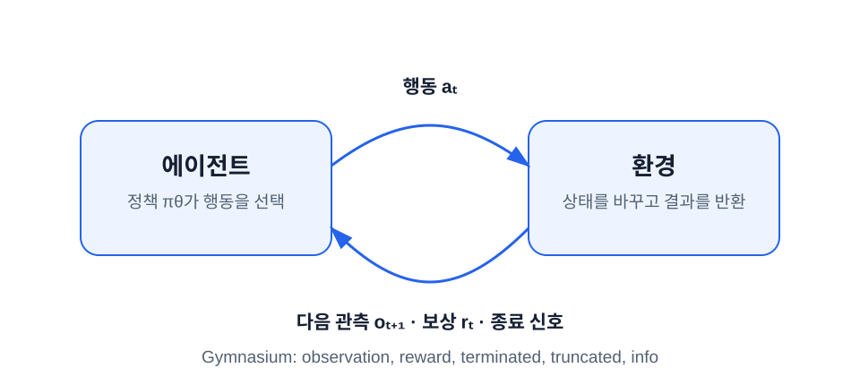
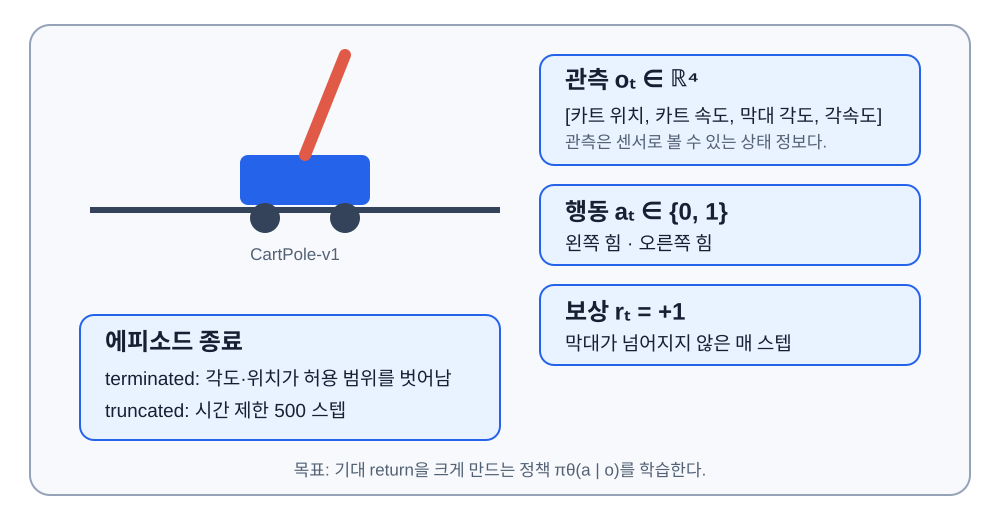

# 강화학습의 언어와 환경 루프

이 장의 중심 질문은 **“강화학습 데이터 한 줄은 어떻게 생기는가?”** 다. 신경망이나 PPO 수식보다 먼저 환경과 한 번 상호작용해 실제 데이터를 본다.

## 학습 목표

이 장을 마치면 다음을 할 수 있다.

1. 에이전트, 환경, 관측, 행동, 보상, transition을 CartPole 예에 대응한다.
2. 에피소드와 rollout을 구분한다.
3. `terminated`와 `truncated`를 구분하고 환경을 올바르게 reset한다.
4. 강화학습 문제를 MDP의 상태·행동·전이·보상·할인율로 표현한다.

## 지도학습과 무엇이 다른가

지도학습은 보통 입력과 정답이 짝지어진 고정 데이터에서 시작한다. 강화학습에는 행동의 정답표가 없다. 에이전트가 행동하면 환경이 바뀌고, 바뀐 환경에서 다음 데이터가 생긴다.

| 질문 | 지도학습 | 강화학습 |
|---|---|---|
| 데이터는 어디서 오는가? | 미리 수집한 데이터셋 | 현재 행동 규칙과 환경의 상호작용 |
| 즉시 정답이 있는가? | 대개 있다. | 행동 대신 보상만 받는다. |
| 한 예측이 다음 입력을 바꾸는가? | 보통 아니다. | 바꾼다. |
| 목표 | 예측 오차 감소 | 미래 누적 보상의 기댓값 증가 |

**강화학습(reinforcement learning, RL)** 은 에이전트가 환경과 반복해 상호작용하고, 행동 뒤에 받은 평가 신호를 이용해 장기적으로 더 나은 행동 규칙을 배우는 분야다. 정답 행동을 직접 받는 대신 시행착오(trial and error)를 겪는다는 점이 핵심이다.

이때 상태나 관측에서 행동을 정하는 규칙을 **정책(policy)** 이라 한다. 아래에서는 먼저 정책이 해결해야 할 문제를 본 뒤 구체적인 확률 표현을 설명한다.

**심층 강화학습(deep reinforcement learning, deep RL)** 은 정책이나 가치 같은 함수를 심층 신경망으로 표현하는 강화학습이다. PPO는 강화학습 알고리즘이고, 이 책에서는 그 정책과 가치를 PyTorch 신경망으로 만들기 때문에 deep RL을 수행한다.

### 가장 작은 출발점: Bandit

**다중 슬롯머신 문제(multi-armed bandit)** 는 상태 변화 없이 여러 행동 중 하나를 반복 선택하는 가장 작은 강화학습 문제다. 예를 들어 버튼 A는 평균 1점, B는 평균 2점을 주지만 처음에는 그 평균을 모른다고 하자.

- 이미 높아 보이는 B를 고르는 것은 **활용(exploitation)** 이다. 현재 지식을 이용한다.
- A도 가끔 눌러 실제로 더 나쁘다는 증거를 모으는 것은 **탐색(exploration)** 이다. 정보를 얻기 위해 불확실한 행동을 시도한다.

탐색만 하면 좋은 행동을 충분히 이용하지 못하고, 활용만 하면 초기에 우연히 좋아 보인 행동에 갇힐 수 있다. 이를 **탐색–활용 딜레마(exploration–exploitation dilemma)** 라 한다. PPO가 한 행동만 고정하지 않고 행동 확률을 출력하는 이유 중 하나다.

Bandit에서는 현재 행동이 다음 상황을 바꾸지 않는다. CartPole에서는 오른쪽으로 민 힘이 다음 카트 위치와 막대 각도를 바꾸고, 그 상태에서 가능한 미래 전체가 달라진다. 이렇게 현재 결정이 미래 상황과 보상에 영향을 주는 문제를 **순차 의사결정(sequential decision making)** 문제라고 한다.

### 즉시 보상만 보면 안 되는 이유

순차 문제에서는 좋은 결과가 여러 스텝 뒤에 나타날 수 있다. 마지막에 막대가 쓰러졌다면 수십 스텝 전의 어떤 힘이 원인이었는지 즉시 알 수 없다. 지연된 결과의 책임을 이전 행동들에 나누는 문제를 **신용 할당 문제(credit assignment problem)** 라 한다. 이후 배울 **return** 은 미래 보상의 누적값, **value** 는 그 return의 평균 예측, **advantage** 는 한 행동이 평소보다 얼마나 나았는지를 나타내며 신용을 수치화한다.

강화학습에서 **에이전트(agent)** 는 행동을 선택하는 학습 주체이고, **환경(environment)** 은 행동을 받아 다음 상황과 보상을 만드는 바깥 시스템이다.



그림의 한 바퀴가 **전이(transition)** 한 개다. 전이는 “행동 전 상황, 행동, 그 결과”를 묶은 데이터 한 줄이다. 환경과 한 번 상호작용하는 이산 시간 단위를 **스텝(step)** 이라 한다. 시점 $t$의 관측 $o_t$에서 행동 $a_t$를 선택하면 환경은 보상 $r_t$, 다음 관측 $o_{t+1}$, 종료 정보를 반환한다.

$$
(o_t, a_t, r_t, o_{t+1}, \text{terminated}_t, \text{truncated}_t)
$$

교재에 따라 행동 $a_t$ 뒤의 보상을 $R_{t+1}$로 쓰기도 한다. 이 책과 코드는 transition index를 맞추기 위해 같은 보상을 $r_t$로 쓴다. 표기만 다르고 “$a_t$를 실행한 뒤 받은 보상”이라는 의미는 같다.

## 환경 API를 읽기 위한 세 용어

- **공간(space)**: 환경이 허용하는 값의 집합과 배열 모양인 shape, 숫자 저장 형식인 dtype, 값의 범위를 나타내는 계약이다.
- **행동 공간(action space)**: 에이전트가 환경에 보낼 수 있는 모든 행동의 집합이다.
- **관측 공간(observation space)**: 환경이 에이전트에게 돌려줄 수 있는 모든 관측의 집합이다.

`Discrete(2)`는 가능한 값이 정수 `0`, `1` 두 개뿐인 이산 공간이다. `Box(low, high, shape, dtype)`는 일정 범위 안의 실수 배열 공간이다. **이산(discrete)** 은 셀 수 있는 선택지, **연속(continuous)** 은 구간 안의 실수 값을 뜻한다.

## 첫 Gymnasium 환경 실행

Gymnasium은 강화학습 환경의 공통 Python **API(Application Programming Interface)** 를 제공하는 라이브러리다. API는 프로그램끼리 어떤 이름과 입력·출력으로 상호작용할지를 정한 약속이다. 다음 코드는 무작위 행동으로 CartPole 한 에피소드를 실행한다.

```python
import gymnasium as gym

env = gym.make("CartPole-v1")
observation, info = env.reset(seed=42)

episode_return = 0.0
finished = False

while not finished:
    action = env.action_space.sample()
    next_observation, reward, terminated, truncated, info = env.step(action)
    episode_return += float(reward)
    observation = next_observation
    finished = terminated or truncated

env.close()
print(episode_return)
```

`reset()`은 첫 관측과 부가 정보 `info`를 반환한다. `step(action)`은 다섯 값을 반환한다. 오래된 예제의 `done` 한 개를 그대로 따라 쓰지 않는다.

!!! warning "무작위 행동은 학습된 정책이 아니다"
    `env.action_space.sample()`은 환경 연결을 시험하는 도구다. 보상이 오르지 않는 것이 정상이다. 학습은 이 자리에 정책의 확률분포를 넣을 때 시작한다.

## CartPole을 강화학습 언어로 번역하기



CartPole의 관측 공간은 shape `(4,)`인 `Box`이고, 실제 관측은 네 실수다.

| 위치 | 의미 | 단위 |
|---:|---|---|
| 0 | 카트 위치 | m |
| 1 | 카트 속도 | m/s |
| 2 | 막대 각도 | rad |
| 3 | 막대 각속도 | rad/s |

행동 공간은 `Discrete(2)`다. `0`과 `1`은 각각 고정된 왼쪽·오른쪽 힘을 뜻한다. 막대가 유지되는 매 스텝 보상 $+1$을 받으므로 에피소드 return이 길이와 같다. 여기서 rad는 각도의 단위인 **라디안(radian)** 이며 $\pi$ rad가 180°다.

보상은 목표 그 자체가 아니라 목표를 숫자로 대신 표현한 **보상 함수(reward function)** 의 출력이다. 잘못 설계하면 에이전트가 의도한 목표가 아니라 점수의 허점을 최적화할 수 있다. CartPole의 단순한 `+1` 보상은 “오래 버틴다”는 목표와 잘 맞지만, 실제 시스템에서는 reward 설계도 검증 대상이다.

## 상태와 관측은 항상 같지 않다

**상태(state)** 는 미래 전이를 결정하기에 충분한 환경 내부 정보다. **관측(observation)** 은 에이전트가 실제로 받은 정보다. CartPole 예에서는 관측을 상태처럼 사용해도 되지만 일반적으로 둘은 다르다.

- 체스판 전체를 보는 에이전트: 관측이 상태에 가깝다.
- 카메라 한 장으로 로봇을 제어하는 에이전트: 관측만으로 가려진 속도나 마찰을 완전히 알 수 없다.
- 카드 게임에서 내 패만 보는 에이전트: 상대 패는 상태의 일부지만 관측에는 없다.

이 책의 수식은 관례적으로 $s_t$를 쓰고 구현은 `observation`을 쓴다. CartPole 범위에서는 네 실수 관측을 정책의 상태 입력으로 취급한다.

## 정책은 행동의 확률분포다

앞서 소개한 **정책(policy)** 을 이제 수식으로 표현한다. 같은 입력에 항상 같은 행동 하나를 내는 규칙은 **결정론적 정책(deterministic policy)** 이고, 행동별 확률을 내고 그 분포에서 뽑는 규칙은 **확률정책(stochastic policy)** 이다. PPO에서는 탐색을 위해 확률정책을 사용한다.

$$
\pi_\theta(a\mid s)=P(a_t=a\mid s_t=s)
$$

$\theta$는 정책의 동작을 바꾸는 숫자 묶음인 **파라미터(parameter)** 며, 이 책에서는 신경망의 가중치와 편향이다. 예를 들어 한 관측에서 정책이 `[왼쪽: 0.3, 오른쪽: 0.7]`을 출력하면 오른쪽만 고정해서 선택하는 것이 아니라 이 분포에서 샘플링한다. **샘플링(sampling)** 은 각 결과가 정해진 확률로 나오도록 무작위로 하나를 뽑는 과정이다. 같은 관측에서도 다른 행동이 나올 수 있다. 행동 확률이 얼마나 고르게 퍼져 있는지를 나타내는 수가 **엔트로피(entropy)** 다. `[0.5, 0.5]`의 entropy가 `[0.99, 0.01]`보다 크다.

## 에피소드, 궤적과 rollout

- **에피소드(episode)**: reset에서 환경 종료까지의 완전한 상호작용 묶음
- **궤적(trajectory, $\tau$)**: 순서가 있는 상태·행동·보상 열
- **rollout**: 현재 정책을 환경에서 실행해 모은 일정 길이의 경험 묶음

여러 데이터 항목을 한꺼번에 처리하도록 묶은 것을 **배치(batch)** 라 한다. Rollout은 강화학습용 batch를 만드는 수집 과정이자 그 결과를 가리킨다. rollout 길이는 에피소드 길이와 같을 필요가 없다. 1,024 transition을 모으는 동안 짧은 에피소드가 여러 번 끝날 수도 있고, 긴 에피소드의 중간에서 rollout이 끊길 수도 있다.

$$
\tau=(s_0,a_0,r_0,s_1,a_1,r_1,\ldots)
$$

## MDP의 다섯 요소

**마르코프 결정 과정(Markov Decision Process, MDP)** 은 강화학습 문제를 상태, 행동, 전이, 보상, 할인율로 표현하는 틀이다.

$$
\mathcal M=(\mathcal S,\mathcal A,P,R,\gamma)
$$

| 기호 | 뜻 | CartPole 대응 |
|---|---|---|
| $\mathcal S$ | 가능한 상태의 집합 | 네 물리량의 가능한 조합 |
| $\mathcal A$ | 가능한 행동의 집합 | `{0, 1}` |
| $P(s'\mid s,a)$ | 행동 뒤 다음 상태의 분포 | CartPole 물리와 초기값 난수 |
| $R(s,a,s')$ | 보상 규칙 | 매 유지 스텝 $+1$ |
| $\gamma$ | 미래 보상의 할인율 | 학습자가 정하는 $0\sim1$ 값 |

**마르코프 성질**은 현재 상태가 주어지면 다음 상태를 예측하는 데 더 오래된 과거가 추가로 필요하지 않다는 가정이다. 환경 코드를 작성할 때 숨겨진 과거 정보가 결과에 영향을 준다면 그 정보를 상태 또는 관측에 포함할지 검토해야 한다.

예를 들어 “현재 위치”만 관측하는 자동차에서 제동거리는 과거 가속의 결과인 현재 속도에도 의존한다. 위치만 상태라 부르면 Markov 성질이 깨지지만 `[위치, 속도]`를 상태로 묶으면 다음 위치 예측에 필요한 정보가 들어간다.

### MDP 다섯 요소 밖에서 함께 정하는 것

- **초기 상태 분포(initial-state distribution, $\rho_0$)**: reset 때 어떤 상태에서 시작할 확률인지 정한다.
- **시간 지평(horizon, $T$)**: 한 episode나 최적화 문제에서 고려하는 최대 스텝 수다.
- **종단 상태(terminal state)**: 문제 자체가 끝나 더 이상 미래 보상이 없는 상태다.

종료가 있는 문제는 **에피소드형 과제(episodic task)** 다. 로봇 온도 제어처럼 명시적 끝없이 계속되는 문제는 **계속형 과제(continuing task)** 다. 계속형 과제에서는 무한히 많은 reward의 합이 발산하지 않도록 $\gamma<1$인 discounted return 등을 사용한다.

관측이 완전한 상태가 아니면 정식으로는 **부분 관측 마르코프 결정 과정(Partially Observable Markov Decision Process, POMDP)** 을 고려한다. 이 책의 CartPole은 현재 관측을 상태로 사용할 수 있는 MDP로 다루고, 기억을 가진 recurrent policy는 후속 학습으로 넘긴다.

## PPO는 강화학습 지도에서 어디에 있는가

알고리즘 이름을 외우기 전에 세 질문으로 위치를 잡는다.

| 분류 질문 | 두 방향 | PPO의 위치 |
|---|---|---|
| 환경의 다음 상태·보상을 예측하는 모델을 사용하는가? | model-based / model-free | **Model-free**: 환경 model을 학습해 계획하지 않고 실제 sample로 policy·value를 학습한다. |
| 무엇을 직접 학습하는가? | value-based / policy optimization | **Policy optimization**: 정책 파라미터를 직접 최적화하며 critic value도 함께 학습한다. |
| 어느 정책이 만든 데이터를 쓰는가? | on-policy / off-policy | **On-policy**: 가장 최근 정책이 만든 rollout을 주로 사용하고 update 뒤 폐기한다. |

여기서 **환경 모델(model)** 은 $(s,a)$를 받아 다음 상태와 보상을 예측하는 함수다. Model-based 방법은 이 model로 미래를 미리 계산해 계획(planning)하고, model-free 방법은 그런 예측 model 없이 policy나 value를 직접 학습한다.

**가치 기반 방법(value-based method)** 은 행동 가치 $Q(s,a)$를 배우고 가장 가치가 큰 행동을 고른다. Q-learning과 DQN이 대표적이다. **정책 최적화(policy optimization)** 는 $\pi_\theta(a\mid s)$를 명시적으로 표현하고 그 파라미터를 바꾼다. 행동분포를 만드는 구성요소를 **actor**, 현재 상태를 평가하는 구성요소를 **critic** 이라 한다. PPO는 actor policy와 critic value를 함께 쓰므로 **actor–critic 계열의 on-policy policy optimization** 이다.

**On-policy** 는 학습하려는 현재 정책과 데이터를 만든 행동 정책이 거의 같은 경우고, **off-policy** 는 다른 과거 정책이나 별도 행동 규칙이 만든 데이터도 학습에 사용할 수 있는 경우다. 이 차이는 5장에서 PPO batch를 왜 오래 보관하지 않는지 설명할 때 다시 사용한다.

**Dynamic programming(동적 계획법)** 과 value/policy iteration은 정확한 환경 model을 알고 작은 표로 모든 상태를 열거할 수 있을 때의 planning 방법이다. SARSA, Q-learning, **Deep Q-Network(DQN)** 는 sample에서 행동 가치를 배우는 value-based 경로다. 이 책은 PPO에 직접 필요한 MDP·value·TD 개념은 포함하지만 이 알고리즘들의 전체 구현은 9장의 별도 학습 경로로 넘긴다.

## `terminated`와 `truncated`

둘 다 에피소드를 끝내므로 reset은 필요하다. 그러나 가치 계산의 의미는 다르다.

| 신호 | 의미 | CartPole 예 | 다음 가치로 bootstrap |
|---|---|---|---|
| `terminated` | MDP 자체의 자연 종료 | 막대 각도나 카트 위치가 한계 초과 | 하지 않음: $V(s_{t+1})=0$ |
| `truncated` | MDP 밖의 제한 때문에 중단 | 500 스텝 시간 제한 | 함: final observation의 $V(s_{t+1})$ 사용 |

**bootstrapping**은 실제 미래 보상을 끝까지 기다리는 대신 다음 상태의 가치 추정치를 사용하는 방법이다. 4장에서 수식으로 다시 계산한다.

!!! danger "한 개의 done만 저장하지 말 것"
    `finished = terminated or truncated`는 reset 판단에는 맞다. 그러나 PPO buffer에 `finished`만 저장하면 bootstrapping 여부를 복원할 수 없다. 두 신호를 별도로 저장한다.

## Worked Example: transition 분해

다음 반환값을 해석해 보자.

```text
observation      = [0.03, 0.22, 0.08, -0.15]
action           = 1
next_observation = [0.04, 0.41, 0.07, -0.44]
reward           = 1.0
terminated       = False
truncated        = False
```

1. 에이전트는 막대와 카트의 네 물리량을 관측했다.
2. 정책은 오른쪽 힘에 해당하는 행동 `1`을 선택했다.
3. 환경은 물리 상태를 한 스텝 진행했다.
4. 막대를 유지했으므로 보상 `1.0`을 받았다.
5. 자연 종료도 시간 제한도 아니므로 다음 관측에서 계속한다.

이 transition 하나만으로 행동이 좋은지 확정할 수는 없다. 현재 행동이 이후 여러 스텝의 결과를 바꾸므로 미래 보상을 묶은 return이 필요하다.

## 직접 확인하기

아래 코드를 추가해 실제 type과 shape를 확인한다.

```python
print(type(observation), observation.shape, observation.dtype)
print(env.observation_space)
print(env.action_space)
```

기대할 핵심은 다음과 같다.

```text
observation: shape (4,), dtype float32
observation_space: Box(..., (4,), float32)
action_space: Discrete(2)
```

## 흔한 오류

| 흔한 오해 | 바로잡기 |
|---|---|
| 보상이 행동의 정답이다. | 보상은 스칼라 평가 신호다. 어떤 행동을 했어야 하는지는 직접 말하지 않는다. |
| 확률정책은 학습이 덜 된 정책이다. | 연속·부분관측·다중해 문제에서는 학습 후에도 확률정책이 필요할 수 있다. |
| 에피소드와 rollout은 같다. | rollout은 학습을 위한 고정 길이 batch이고 여러 에피소드를 포함할 수 있다. |
| `truncated`도 실패이므로 다음 가치는 0이다. | 시간 제한은 자연 terminal이 아니므로 final observation 가치로 bootstrap한다. |
| 환경을 미분해야 정책을 학습한다. | policy gradient는 환경이 아니라 선택 행동의 로그확률을 미분한다. |

## 정리

- 강화학습은 정답 레이블이 아니라 행동의 결과인 보상으로 배운다. 데이터 분포 자체가 현재 정책에 따라 달라진다.
- transition 한 개는 `(관측, 행동, 보상, 다음 관측, terminated, truncated)`이며 환경 API가 한 번에 반환하는 단위다.
- `terminated`는 MDP의 자연 종료, `truncated`는 시간 제한이다. 둘 다 reset을 부르지만 가치 계산에서는 다르게 다룬다.
- episode는 환경 종료 기준, rollout은 수집량 기준이다. 한 rollout 안에 여러 episode가 들어갈 수 있다.
- MDP의 다섯 요소(상태·행동·전이·보상·할인율)가 이후 모든 PPO 기호의 출발점이다.

## 연습문제

1. 로봇 청소기 문제의 상태, 관측, 행동, 보상 후보를 각각 한 줄로 적어라.
2. `terminated=False`, `truncated=True`인 transition에서 reset 여부와 bootstrap 여부를 각각 답하라.
3. 길이 1,024 rollout 안에서 200, 500, 324 스텝의 에피소드 세 개가 끝났다. rollout과 에피소드가 왜 다른지 설명하라.
4. 정책 `[0.5, 0.5]`와 `[0.01, 0.99]` 중 entropy가 큰 쪽을 직관으로 고르라.

??? note "정답 확인"
    2번: reset은 한다. 자연 terminal은 아니므로 final observation의 가치로 bootstrap한다. 3번: rollout은 수집량 기준이고 episode는 환경 종료 기준이다. 4번: 두 행동이 같은 확률인 `[0.5, 0.5]`의 불확실성이 더 크다.

## 참고문헌

- [Stanford CS234: Introduction to Reinforcement Learning](https://web.stanford.edu/class/cs234/modules.html)
- [UC Berkeley CS 185/285: Lecture 4 RL Basics](https://rail.eecs.berkeley.edu/deeprlcourse/)
- [Gymnasium Basic Usage](https://gymnasium.farama.org/main/introduction/basic_usage/)
- [Gymnasium CartPole-v1](https://gymnasium.farama.org/environments/classic_control/cart_pole/)

[← 목차](./index.md) · [2장: MDP, 가치와 PPO를 위한 최소 수학 →](./02-mdp-value-and-math.md)
