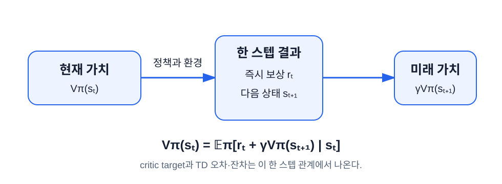

# MDP, 가치와 PPO를 위한 최소 수학

이 장의 중심 질문은 **“정책을 평가하고 PPO 수식을 읽는 데 필요한 최소 수학은 무엇인가?”** 다. Stanford CS234가 policy gradient 전에 배치하는 MDP와 policy evaluation을 PPO에 필요한 깊이로 압축하고, Berkeley CS 185/285의 확률 복습을 결합한다.

## 학습 목표

이 장을 마치면 다음을 할 수 있다.

1. 짧은 보상 열의 discounted return을 계산한다.
2. 상태 가치와 행동 가치를 기댓값으로 설명한다.
3. Bellman 관계, TD target, TD 오차·잔차를 한 스텝 그림으로 연결한다.
4. 로그확률, 기댓값, 기울기, chain rule이 policy gradient에서 맡는 역할을 설명한다.

## 먼저 읽는 기호와 한 스텝 시간선

수식의 아래 첨자 $t$는 **시간 단계(time step)** 다. 다음 한 줄을 기준으로 모든 기호를 읽는다.

```text
시점 t의 상태 s_t → 행동 a_t 선택 → 보상 r_t와 다음 상태 s_{t+1} 관측
```

| 기호 | 읽는 법 | 이 책에서의 뜻 |
|---|---|---|
| $s_t$ | 에스 티 | 시점 $t$의 상태 |
| $a_t$ | 에이 티 | $s_t$에서 고른 행동 |
| $r_t$ | 알 티 | $a_t$ 뒤 받은 보상 |
| $T$ | 대문자 티 | 에피소드의 마지막 시간 또는 길이 |
| $\gamma$ | 감마 | 미래 보상의 할인율 |
| $\pi(a\mid s)$ | 파이 | 상태 $s$에서 행동 $a$를 고르는 정책 |
| $\theta$ | 세타 | actor의 조절 가능한 숫자 묶음 |
| $\phi$ | 파이 또는 피 | critic의 조절 가능한 숫자 묶음 |

교재에 따라 행동 $a_t$ 뒤 받은 보상을 $R_{t+1}$로 쓴다. 이 책의 $r_t$와 **같은 사건을 다른 첨자로 표시한 것**이다. 코드를 수식과 비교할 때 가장 흔한 혼동이므로 어느 규약인지 먼저 확인한다.

!!! warning "$r_t$는 보상이고 $r_t(\theta)$는 보상이 아니다"
    이 책에서 괄호 없는 $r_t$는 **언제나 보상**이다. 5장에서 PPO가 쓰는 **확률비(probability ratio)** 는 모양이 닮았지만 전혀 다른 값이며, 이 책은 그것을 항상 $\theta$를 붙여 $r_t(\theta)$로 쓴다. 괄호 안의 $\theta$가 있는지가 두 기호를 가르는 유일한 표시다. PPO 논문도 확률비를 $r_t(\theta)$로 쓰므로 논문을 읽을 때도 같은 기준이 통한다.

## 이 장에서 가르치는 수학과 별도로 넘기는 수학

확률변수·기댓값·분산, 함수·미분·gradient, 지수·로그처럼 PPO 수식을 읽는 데 바로 필요한 개념은 이 장에서 처음부터 설명한다. 선형대수 전체와 엄밀한 확률론·미적분 증명은 한 장에 책임 있게 담기 어려우므로 다음 키워드는 별도 선수학습으로 넘긴다.

- 벡터와 행렬의 일반적인 곱셈 규칙: `vector`, `matrix`, `matrix multiplication`
- 여러 변수를 한꺼번에 미분하는 엄밀한 이론: `multivariable calculus`, `partial derivative`, `chain rule`
- 연속확률분포의 적분 이론: `probability density`, `integral`, `change of variables`

다만 이 책의 CartPole PPO 코드를 실행하고 각 줄의 역할을 이해하는 데 필요한 범위는 본문 예제로 모두 다룬다.

## Reward와 return

reward $r_t$는 한 transition 직후의 신호다. **return $G_t$** 는 시점 $t$ 이후 reward를 할인해 더한 값이다.

$$
G_t=r_t+\gamma r_{t+1}+\gamma^2r_{t+2}+\cdots
$$

$\gamma$는 **할인율(discount factor)** 이며 $0\le\gamma\le1$이다. 할인율은 확률이 아니다. 미래 보상을 현재 목표에서 얼마나 약하게 셀지를 정하는 문제 설정의 숫자다.

- $\gamma=0$: 지금 reward만 본다.
- $\gamma$가 1에 가까움: 먼 미래 reward도 크게 반영한다.
- 유한 에피소드에서 $\gamma=1$: reward를 단순 합한다.

끝이 있는 **episodic task**에서는 마지막 시점을 $T$라 하고 합을 거기서 멈춘다. 끝없이 이어지는 **continuing task**에서는 무한합이 유한한 값으로 수렴하도록 보통 $\gamma<1$을 쓴다. 따라서 할인은 (1) 먼 미래보다 가까운 보상을 선호하게 하고, (2) 무한한 보상 합이 발산하지 않게 하는 두 역할을 한다.

### Worked Example: 네 스텝 return

reward가 `[1, 0, 2, 3]`, $\gamma=0.5$라 하자.

$$
\begin{aligned}
G_3 &= 3 \\
G_2 &= 2 + 0.5(3) = 3.5 \\
G_1 &= 0 + 0.5(3.5) = 1.75 \\
G_0 &= 1 + 0.5(1.75) = 1.875
\end{aligned}
$$

뒤에서부터 $G_t=r_t+\gamma G_{t+1}$로 계산하면 거듭제곱을 매번 직접 쓰지 않아도 된다.

[할인 return 실험실에서 γ와 reward 열 바꾸기](./assets/discounted-return/discounted-return-lab.html)

## 확률의 최소 언어: 확률변수, 분포, 표본

**확률변수(random variable)** 는 우연한 결과를 숫자로 표현한 것이다. “한 에피소드의 return”은 실행할 때마다 달라질 수 있으므로 확률변수다. 이 값이 어떤 확률로 나타나는지를 모아 놓은 규칙이 **확률분포(distribution)** 다. 실제로 한 번 실행해 얻은 값 하나는 **표본(sample)** 이다.

조건부확률 $P(A\mid B)$는 “사건 $B$가 일어났다는 조건에서 사건 $A$가 일어날 확률”이다. MDP의 전이 확률

$$
P(s'\mid s,a)
$$

는 “현재 상태가 $s$이고 행동이 $a$일 때 다음 상태가 $s'$일 확률”이라고 읽는다. 세로 막대 $\mid$는 **~라는 조건에서**라는 뜻이다.

## 기댓값은 가능한 결과의 확률 가중 평균이다

정책과 환경에는 우연성이 있다. 같은 상태에서도 정책이 다른 행동을 샘플링하거나 환경 전이가 달라질 수 있다. **기댓값(expectation)** 은 각 가능한 값에 그 확률을 곱해 더한 평균이다.

주사위 대신 두 행동만 생각하자.

| 행동 | 정책 확률 | 예상 return |
|---|---:|---:|
| 왼쪽 | 0.25 | 4 |
| 오른쪽 | 0.75 | 8 |

기대 return은 $0.25(4)+0.75(8)=7$이다. 실제 한 에피소드의 return은 4나 8이지만, 정책의 목적은 이런 반복 평균을 크게 만드는 것이다.

$$
J(\theta)=\mathbb E_{\tau\sim\pi_\theta}[G_0]
$$

기호 $\tau\sim\pi_\theta$는 정책 $\pi_\theta$로 상호작용해 궤적 $\tau$를 샘플링한다는 뜻이다.

기댓값 $7$은 실제 한 번의 실행 결과가 반드시 7이라는 뜻이 아니다. 가능한 결과와 그 확률을 알고 계산한 것이 **기댓값**, 유한 번 실행해 얻은 값들을 더하고 개수로 나눈 것이 **표본평균(sample mean)** 이다. 시행 횟수가 충분히 많으면 표본평균이 기댓값에 가까워지는 경향이 있지만, 적은 수의 에피소드에서는 크게 다를 수 있다.

## 분산과 표준편차는 흔들림의 크기다

값 $x_1,\ldots,x_N$의 평균을 $\bar x$라 할 때, 편차 $x_i-\bar x$는 각 값이 평균에서 얼마나 떨어졌는지다. 편차를 그대로 더하면 양수와 음수가 상쇄되므로 제곱해 평균낸다.

$$
\operatorname{Var}(X)=\mathbb E[(X-\mathbb E[X])^2]
$$

이 값이 **분산(variance)** 이고, 분산의 제곱근이 **표준편차(standard deviation)** 다. 예를 들어 `[4, 8]`의 평균은 6, 평균에서의 거리는 `[-2, 2]`, 분산은 $(4+4)/2=4$, 표준편차는 2다. 단위가 원래 값과 같은 표준편차가 보통 더 직관적이다.

강화학습에서는 같은 설정도 return과 gradient가 실행마다 달라진다. 그래서 평균만 보고 “안정적”이라고 판단하지 않고 표준편차와 여러 seed를 함께 본다.

## 가치 함수: 미래 return의 평균 예측

**상태 가치 함수(state-value function)** 는 상태 $s$에서 정책 $\pi$를 계속 따를 때 얻을 return의 기댓값이다.

$$
V^\pi(s)=\mathbb E_\pi[G_t\mid s_t=s]
$$

**행동 가치 함수(action-value function)** 는 상태 $s$에서 행동 $a$를 한 뒤 정책을 따를 때의 기대 return이다.

$$
Q^\pi(s,a)=\mathbb E_\pi[G_t\mid s_t=s,a_t=a]
$$

두 값은 실제 미래를 맞힌 단일 정답이 아니라 여러 가능한 미래의 평균이다.

상태 가치는 그 상태에서 정책이 고를 수 있는 행동 가치의 확률 가중 평균이다.

$$
V^\pi(s)=\sum_a\pi(a\mid s)Q^\pi(s,a)
$$

행동이 두 개이고 정책 확률과 행동 가치가 다음과 같다면 $V^\pi(s)=0.25(4)+0.75(8)=7$이다.

| 행동 | $\pi(a\mid s)$ | $Q^\pi(s,a)$ | $A^\pi(s,a)=Q^\pi(s,a)-V^\pi(s)$ |
|---|---:|---:|---:|
| 왼쪽 | 0.25 | 4 | -3 |
| 오른쪽 | 0.75 | 8 | 1 |

위 표의 마지막 열이 **advantage(이점) 함수** $A^\pi(s,a)=Q^\pi(s,a)-V^\pi(s)$이며, 특정 행동 가치가 그 상태의 평균 가치보다 얼마나 나은지를 나타낸다. 양수면 그 상태의 정책 평균보다 좋은 행동, 음수면 나쁜 행동이다. 여기서는 정의까지만 본다. PPO가 $Q^\pi$를 모르는 채로 이 값을 어떻게 추정해 actor에 넣는지는 4장에서 baseline과 GAE로 다룬다.

## Bellman 관계: 긴 미래를 한 스텝으로 접기



return의 첫 항을 떼면 가치도 한 스텝 관계로 쓸 수 있다.

$$
V^\pi(s_t)=\mathbb E_\pi[r_t+\gamma V^\pi(s_{t+1})\mid s_t]
$$

이 식을 **Bellman expectation equation** 이라 한다. 한 상태의 가치를 즉시 reward와 다음 상태 가치로 갱신하는 그림을 **backup** 이라고 부른다.

### Worked Example: 두 상태 가치

상태 `safe`에서 reward 1을 받고 확률 0.8로 `safe`, 확률 0.2로 terminal로 간다고 하자. terminal의 가치는 0, $\gamma=0.9$다.

$$
V(\text{safe})=1+0.9[0.8V(\text{safe})+0.2(0)]
$$

정리하면 다음과 같다.

$$
0.28V(\text{safe})=1,\qquad V(\text{safe})\approx3.571
$$

계속 reward 1을 받을 가능성이 있으므로 한 스텝 reward보다 가치가 크다.

## Policy evaluation, control과 함수 근사

**policy evaluation** 은 정책을 고정하고 그 정책의 $V^\pi$를 구하는 문제다. PPO의 critic은 정확한 표를 만드는 대신 신경망 $V_\phi(s)$로 이를 근사한다.

정책을 평가하는 데서 더 나아가 더 좋은 정책을 찾는 문제를 **control(제어)** 이라 한다. Actor–critic은 critic의 policy evaluation과 actor의 policy improvement를 번갈아 수행하는 제어 방법이다.

상태마다 값을 배열 한 칸에 저장하는 방법을 **tabular method(표 방식)** 라 한다. 상태가 유한하고 작을 때는 정확한 표가 가능하다. CartPole의 위치·속도·각도·각속도는 연속된 실수이므로 가능한 조합이 사실상 무한하다. 신경망 같은 매개변수 함수로 보지 못한 상태의 값까지 일반화하는 **function approximation(함수 근사)** 이 필요한 이유다.

학습 모델이 맞추도록 만든 목표 숫자를 **target(목푯값)** 이라 한다. 예측 문제에서 **잔차(residual)** 는 목푯값에서 현재 예측값을 뺀, 아직 설명하지 못한 차이다.

$$
e_t=y_t-\hat y_t
$$

예를 들어 목푯값이 7이고 예측이 5라면 잔차는 $+2$다. 모델이 2만큼 낮게 예측했다는 뜻이다. 예측이 9라면 잔차는 $-2$이며 2만큼 높게 예측했다는 뜻이다. 회귀 모델은 흔히 $e_t^2$처럼 잔차의 제곱을 줄이도록 학습한다. 제곱하면 양수와 음수가 상쇄되지 않고 큰 오차를 더 크게 벌점으로 준다.

한 transition에서 만든 TD target은 다음과 같다.

$$
y_t=r_t+\gamma b_tV_\phi(s_{t+1})
$$

$b_t$는 **bootstrap mask(부트스트랩 마스크)** 이며 다음 가치를 더할지 말지를 정하는 0 또는 1이다. 자연 terminal 여부를 $d_t\in\{0,1\}$로 쓰면 $b_t=1-d_t$가 되지만, 두 극성을 오가면 부호를 뒤집어 읽기 쉬우므로 이 책과 예제 코드는 앞으로 **항상 $b_t$ 쪽만** 쓴다. 자연 terminal이면 $b_t=0$이라 다음 가치를 더하지 않고, 시간 제한 truncation이면 $b_t=1$로 두어 final observation의 가치를 사용한다. 예제 코드의 변수명도 `bootstrap_mask`로 같다. 4장에서 GAE 재귀를 끊는 continuation mask $c_t$와 나란히 비교한다.

**시간차 오차(temporal-difference error, TD error)** 는 TD target과 현재 가치 예측의 차이다. GAE 논문과 일부 구현은 같은 양을 **TD 잔차(TD residual)** 라 부른다. 이 책에서는 두 이름이 같은 $\delta_t$를 가리키며, 이후에는 GAE와의 연결을 강조할 때 “TD 잔차”라고 쓴다.

$$
\delta_t=r_t+\gamma b_tV_\phi(s_{t+1})-V_\phi(s_t)
$$

$\delta_t>0$이면 관찰한 한 스텝 결과가 현재 가치 예측보다 좋았고, $\delta_t<0$이면 나빴다는 뜻이다. 4장에서 이 TD 잔차를 여러 스텝 연결해 GAE를 만든다.

!!! note "TD 잔차와 Bellman 잔차의 정밀한 차이"
    $\delta_t$는 실제 transition 하나에서 계산한 **표본 수준**의 차이다. 일부 문헌에서 Bellman 잔차는 가능한 다음 상태와 행동을 평균낸 $\mathbb E[r_t+\gamma V(s_{t+1})\mid s_t]-V(s_t)$를 가리킨다. 같은 상태에서 여러 transition의 TD 잔차를 평균내면 이 기대 잔차를 추정한다. 입문 구현에서는 두 표현을 느슨하게 섞기도 하므로, 수식이 표본 한 개를 뜻하는지 기댓값을 뜻하는지 확인한다.

!!! warning "잔차를 쓴다고 모두 잔차 학습은 아니다"
    PPO가 TD 잔차로 advantage를 계산한다는 사실만으로 PPO 전체를 “잔차 강화학습”이라 부르지는 않는다. 잔차 강화학습은 기존 제어 행동에 학습된 보정 행동을 더하는 별도 설계이며 8장에서 구분한다. ResNet의 잔차 연결도 또 다른 신경망 구조 용어다.

## Monte Carlo와 TD의 차이

**Monte Carlo(MC)** 방식은 에피소드가 끝난 뒤 실제로 관찰한 전체 return을 target으로 쓴다. **시간차 학습(Temporal-Difference learning, TD learning)** 은 한 스텝 reward와 아직 학습 중인 다음 가치 예측을 섞는다. 여기서 “시간차”는 연속한 시점의 가치 예측 사이에 reward를 더해 생긴 차이 $\delta_t$로 현재 예측을 고친다는 뜻이다. 아직 모르는 값을 다른 추정값으로 대신하는 것을 **bootstrap**이라 한다.

| 방식 | target | 장점 | 약점 |
|---|---|---|---|
| Monte Carlo | episode 끝까지의 실제 $G_t$ | bootstrap에서 오는 편향이 없다. | 끝까지 기다리고 분산이 크다. |
| TD(0) | $r_t+\gamma V(s_{t+1})$ | 한 스텝 후 갱신하고 분산이 낮다. | 부정확한 가치로 bootstrap한다. |

**편향(bias)** 은 추정치의 장기 평균이 참값에서 체계적으로 벗어난 정도이고, 분산은 표본마다 추정치가 흔들리는 정도다. 과녁에 빗대면 한쪽으로 모여 있으면 편향이 크고, 사방으로 흩어져 있으면 분산이 크다. MC는 학습 중인 가치 예측을 target에 넣지 않아 bootstrap 편향은 없지만 궤적 전체의 우연성을 받는다. TD는 더 안정적일 수 있지만 잘못된 다음 가치 예측을 물려받는다. GAE의 $\lambda$는 이 두 극단 사이에서 여러 길이의 정보를 섞는 손잡이다.

## 로그와 로그확률

확률 여러 개의 곱은 매우 작아질 수 있다. 로그는 곱을 합으로 바꾼다.

$$
\log(xy)=\log x+\log y
$$

자연로그 $\log x$는 “밑 $e\approx2.718$를 몇 제곱해야 $x$가 되는가”를 나타낸다. **지수함수** $\exp(y)=e^y$는 자연로그의 역함수라서 $\exp(\log x)=x$다. 확률이 $0<p\le1$이면 $\log p\le0$이며, 더 가능성 높은 사건일수록 로그확률이 0에 가깝다.

궤적 확률에는 여러 시점의 정책 확률이 곱으로 들어간다. 로그를 취하면 시점별 `log_prob` 합으로 바뀌며, PyTorch 확률분포도 `log_prob()`을 직접 제공한다.

로그확률의 **차이**를 지수로 되돌리면 두 확률의 비가 된다. 즉 $\exp(\log p-\log q)=p/q$이며, 확률을 직접 나누는 것보다 수치적으로 안정적이다. PPO는 바로 이 계산으로 old 정책과 현재 정책의 확률비 $r_t(\theta)$를 구한다. 정의와 쓰임은 5장에서 다룬다.

## 함수, 파라미터와 목적함수

**함수(function)** 는 입력을 출력으로 바꾸는 규칙이다. $f(x)=x^2$은 입력 3을 출력 9로 바꾼다. 신경망도 관측을 행동 점수로 바꾸는 큰 함수다. 함수의 동작을 바꿀 수 있는 내부 숫자를 **파라미터(parameter)** 라 하고, actor 파라미터 전체를 $\theta$로 쓴다.

학습으로 크게 만들고 싶은 기준을 **목적함수(objective)** $J(\theta)$라 한다. 반대로 optimizer가 작게 만들 값은 **손실(loss)** 이다. 기대 return을 최대화하고 싶다면 loss를 $-J(\theta)$로 만들어 최소화할 수 있다. 부호가 바뀌었을 뿐 같은 목표다. 강화학습에서 $J(\theta)$가 구체적으로 무엇인지는 4장에서 기대 return $\mathbb E_{\tau\sim\pi_\theta}[G_0]$로 정의한다.

## 미분, gradient와 chain rule

미분은 입력을 조금 바꿀 때 출력이 어느 방향으로 얼마나 변하는지 나타낸다. 신경망 파라미터가 여러 개면 각 파라미터에 대한 편미분을 모은 벡터가 **gradient** 다.

예를 들어 $f(x)=x^2$의 미분은 $f'(x)=2x$다. $x=3$에서는 기울기가 6이므로 $x$를 조금 늘리면 $f$가 커진다. 입력이 $x,y$ 두 개면 “$y$는 고정하고 $x$만 바꿀 때”의 미분 $\partial f/\partial x$처럼 각 입력에 대한 **편미분(partial derivative)** 을 구한다. 이 편미분들을 모은 것이 gradient다.

정책 최적화는 기대 return이 커지는 방향을 찾는다.

$$
\theta\leftarrow\theta+\alpha\nabla_\theta J(\theta)
$$

$\alpha$는 한 번에 얼마나 움직일지 정하는 **학습률(learning rate)** 이다. `+` 방향으로 목적을 키우는 것은 **gradient ascent**, `-` 방향으로 loss를 줄이는 것은 **gradient descent**다.

PyTorch optimizer는 보통 loss를 최소화하므로 구현에서는 $-J$를 loss로 만든 뒤 gradient descent를 한다.

**합성함수**는 한 함수의 출력을 다른 함수의 입력으로 넣은 것이다. $y=2x$, $z=y^2$라면 $x=3$에서 $dy/dx=2$, $dz/dy=2y=12$이므로 $dz/dx=12\times2=24$다. 이렇게 경로의 미분을 곱해 연결하는 규칙이 **chain rule(연쇄법칙)** 이다. PPO 코드에서 loss는 ratio에, ratio는 새 log probability에, log probability는 actor logits에, logits는 신경망 파라미터에 의존한다. `loss.backward()`가 이 경로를 거꾸로 따라간다.

확률분포에 대한 기댓값을 미분할 때는 여기에 더해 다음 **로그미분 항등식**이 필요하다.

$$
\nabla_\theta p_\theta(x)=p_\theta(x)\nabla_\theta\log p_\theta(x)
$$

이 항등식이 미분을 다시 기댓값 꼴로 되돌려 policy gradient를 샘플 평균으로 추정할 수 있게 만든다. 네 단계 유도와 그 결과로 얻는 추정식은 4장에서 따라간다.

## 후속 학습으로 넘기는 대학 과정 내용

Stanford CS234는 다음 내용을 policy gradient 전에 더 깊게 다룬다. PPO 직접 구현의 필수 선수는 아니므로 이 책에서는 상세 증명·구현을 건너뛴다.

- finite MDP와 dynamic programming
- iterative policy evaluation
- value iteration과 policy iteration
- Monte Carlo prediction
- TD(0), SARSA, Q-learning
- tabular method에서 function approximation으로의 확장

**Dynamic programming(동적 계획법)** 은 환경의 전이와 보상 모델을 알고 있을 때 Bellman 관계를 반복 적용해 가치와 정책을 계산하는 방법군이다. **SARSA**와 **Q-learning**은 경험으로 행동 가치를 학습하는 대표적인 TD control 알고리즘이고, **DQN**은 Q-learning의 행동 가치 표를 신경망으로 바꾼 방법이다. 이들의 전체 알고리즘과 구현은 PPO 한 장에 넣으면 학습 목표가 갈라지므로 건너뛴다. PPO 뒤에 강화학습 전반을 체계적으로 넓히려면 위 순서로 다시 학습한다.

## 연습문제

1. reward `[2, -1, 3]`, $\gamma=0.5$의 $G_0,G_1,G_2$를 계산하라.
2. 두 확률 $p=0.20$, $q=0.25$에 대해 $\exp(\log p-\log q)$의 값을 계산하라.
3. `terminated=True`이고 $r=1$, $\gamma=0.9$, $V(s)=0.4$, $V(s')=100$일 때 TD 잔차를 계산하라.
4. `truncated=True`이고 나머지 값이 3번과 같을 때 TD 잔차를 계산하라.
5. 상태 가치가 $V^\pi(s)=7$이고 어떤 행동의 행동 가치가 $Q^\pi(s,a)=5$일 때 그 행동의 advantage는 얼마이며 무엇을 뜻하는가?

??? note "정답 확인"
    1번: $G_2=3$, $G_1=0.5$, $G_0=2.25$. 2번: $0.20/0.25=0.8$. 3번: 자연 종료이므로 $b_t=0$이라 다음 가치를 버려 $1-0.4=0.6$. 4번: 시간 제한은 $b_t=1$로 bootstrap하므로 $1+0.9(100)-0.4=90.6$. 5번: $5-7=-2$이며 그 상태의 정책 평균보다 나쁜 행동이라는 뜻이다.

## 대학 강의와 추가 읽기

- [Stanford CS234 Winter 2026 Lecture Materials](https://web.stanford.edu/class/cs234/modules.html): MDP planning, policy evaluation, policy gradient
- [UC Berkeley CS 185/285 Spring 2026](https://rail.eecs.berkeley.edu/deeprlcourse/): Probability Review, RL Basics
- [MIT OCW 2.997 Syllabus](https://ocw.mit.edu/courses/2-997-decision-making-in-large-scale-systems-spring-2004/pages/syllabus/)
- Sutton & Barto, *Reinforcement Learning: An Introduction*, Chapters 3–6, 13: [저자 공개 PDF](http://incompleteideas.net/book/the-book-2nd.html)

[← 1장](./01-reinforcement-learning-mental-model.md) · [목차](./index.md) · [3장: 정책을 위한 PyTorch 기초 →](./03-pytorch-for-policies.md)
