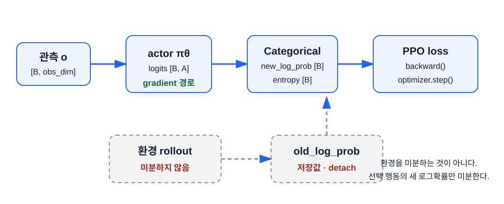

# 정책을 위한 PyTorch 기초

이 장의 중심 질문은 **“정책과 가치 계산을 PyTorch tensor로 어떻게 표현하는가?”** 다. Berkeley CS 185/285의 PyTorch tutorial 역할을 PPO에 필요한 API로 좁힌다.

## 학습 목표

이 장을 마치면 다음을 할 수 있다.

1. PPO의 주요 tensor shape와 dtype을 설명한다.
2. actor logits로 `Categorical` 정책을 만들고 행동·로그확률·entropy를 구한다.
3. critic의 `[B, 1]` 출력을 `[B]` 가치로 바꾼다.
4. autograd가 흐르는 경계와 `detach`해야 하는 old 데이터를 구분한다.
5. `zero_grad → backward → gradient clip → step` 순서를 작성한다.

## 환경 설치

이 책 폴더에서 가상환경을 만든다. Windows PowerShell 예다.

```powershell
py -3.12 -m venv .venv-ppo
.\.venv-ppo\Scripts\Activate.ps1
python -m pip install --upgrade pip
```

PyTorch는 운영체제와 GPU에 따라 설치 명령이 달라진다. [PyTorch 공식 설치 선택기](https://pytorch.org/get-started/locally/)에서 명령을 확인한 뒤 설치한다. CPU CartPole만 사용할 때는 일반 PyPI wheel로도 충분하다.

```powershell
python -m pip install -r requirements.txt
```

설치를 확인한다.

```powershell
python -c "import torch, gymnasium, torchrl; print(torch.__version__, gymnasium.__version__, torchrl.__version__)"
```

이 자료의 확인 기준은 PyTorch 2.13.0, Gymnasium 1.3.0, TorchRL 0.13.3이다.

## 신경망은 파라미터가 있는 함수다

**신경망(neural network)** 은 입력 숫자를 출력 숫자로 바꾸는 함수이며, 데이터에 맞게 조절되는 많은 파라미터를 갖는다. 가장 기본 부품인 **선형층(linear layer)** 은 다음 계산을 한다.

$$
y=Wx+b
$$

- $x$: 입력 숫자 묶음
- $W$: 각 입력을 얼마나 반영할지 정하는 **가중치(weight)**
- $b$: 결과 전체를 옮기는 **편향(bias)**
- $y$: 출력 숫자 묶음

입력 하나인 작은 예에서 $w=2$, $b=-1$, $x=3$이면 $y=2(3)-1=5$다. 학습은 원하는 출력이 나오도록 $w$와 $b$를 조금씩 바꾸는 과정이다.

선형층만 여러 개 이어도 전체는 다시 하나의 선형 계산으로 합칠 수 있다. 사이에 **활성화 함수(activation function)** 를 넣어 곡선 같은 비선형 관계를 표현한다. 이 책은 다음 함수를 쓴다.

$$
\tanh(x)=\frac{e^x-e^{-x}}{e^x+e^{-x}}
$$

`Tanh`는 모든 실수를 -1과 1 사이로 바꾼다. 선형층과 활성화 함수를 여러 **층(layer)** 으로 쌓은 구조를 **다층 퍼셉트론(multilayer perceptron, MLP)** 이라 한다. 입력이 첫 층부터 마지막 층까지 지나 출력이 계산되는 과정을 **순전파(forward pass)** 라 한다.

```text
관측 x → Linear → Tanh → Linear → Tanh → Linear → 출력
          학습되는 W,b          학습되는 W,b
```

Actor MLP는 관측을 행동 점수로, critic MLP는 관측을 기대 return 하나로 바꾼다. 둘 다 입력과 정답을 외워 두는 표가 아니라 파라미터를 공유하는 함수이므로 보지 못한 비슷한 관측에도 값을 낼 수 있다.

## Tensor는 숫자와 shape를 함께 가진다

PyTorch **tensor** 는 다차원 숫자 배열이다. Tensor의 **차원 수**는 필요한 축(axis)의 개수이고, **shape**는 각 축의 길이다. `dtype`은 숫자를 저장하는 형식, `device`는 CPU나 GPU 중 계산이 이루어지는 장소다. PPO에서는 의미를 shape에 붙여 읽어야 한다.

```python
import torch

observations = torch.tensor(
    [
        [0.03, 0.22, 0.08, -0.15],
        [0.04, 0.41, 0.07, -0.44],
        [0.05, 0.60, 0.05, -0.71],
    ],
    dtype=torch.float32,
)

print(observations.shape)  # torch.Size([3, 4])
```

첫 차원 `3`은 batch의 transition 수 $B$, 둘째 차원 `4`는 CartPole 관측 크기다.

이 tensor는 축이 두 개라 2차원이고 shape가 `[3, 4]`다. `observations[1, 2]`는 두 번째 transition의 세 번째 관측값을 고른다. 인덱스가 0부터 시작하기 때문이다.

| 값 | 권장 shape | dtype | 이유 |
|---|---|---|---|
| observations | `[B, obs_dim]` | `float32` | 신경망 입력 |
| discrete actions | `[B]` | `long` | `Categorical.log_prob`의 범주 index |
| logits | `[B, n_actions]` | `float32` | 행동별 정규화 전 점수 |
| log probabilities | `[B]` | `float32` | ratio 계산 |
| rewards | `[B]` | `float32` | return·GAE 계산 |
| values | `[B]` | `float32` | critic 예측 |
| terminated/truncated | `[B]` | `bool` | 서로 다른 mask 생성 |

`float32`는 소수점을 포함한 실수를 32비트로 저장하고, `long`은 범주 index에 쓰는 64비트 정수, `bool`은 `True/False` 논리값이다. 같은 숫자처럼 보여도 연산과 API가 요구하는 dtype이 다르다.

shape 오류는 실행 즉시 예외가 나기도 하지만 **broadcasting**으로 조용히 잘못된 계산을 만들기도 한다. Broadcasting은 크기가 1이거나 빠진 축을 자동으로 늘여 서로 다른 shape를 계산하는 규칙이다. 예를 들어 `[B]`와 `[B, 1]`을 곱하면 원하는 `[B]`가 아니라 각 원소 조합을 담은 `[B, B]`가 생길 수 있다. 값은 나오지만 학습 의미가 완전히 달라지는 위험한 오류다. 각 함수 입구에서 shape를 먼저 기록하고 필요하면 `assert tensor.shape == (...)`로 검사한다.

## Actor와 critic 만들기

`nn.Module`은 파라미터와 순전파 계산을 묶는 PyTorch 모델의 기본 단위다. `nn.Linear`와 `nn.Tanh`도 module이며, `nn.Sequential`은 전달된 module을 순서대로 연결한다. `model.parameters()`는 optimizer가 바꿔야 할 weight와 bias를 모아 준다.

CartPole actor는 관측 네 개를 받아 행동 logits 두 개를 출력한다. critic은 관측 네 개를 받아 가치 하나를 출력한다.

```python
from torch import nn

actor = nn.Sequential(
    nn.Linear(4, 64),
    nn.Tanh(),
    nn.Linear(64, 64),
    nn.Tanh(),
    nn.Linear(64, 2),
)

critic = nn.Sequential(
    nn.Linear(4, 64),
    nn.Tanh(),
    nn.Linear(64, 64),
    nn.Tanh(),
    nn.Linear(64, 1),
)

logits = actor(observations)                 # [B, 2]
values = critic(observations).squeeze(-1)    # [B]
```

마지막 `squeeze(-1)`은 크기가 1인 마지막 차원만 없앤다. 인수 없는 `squeeze()`는 batch가 1일 때 batch 차원도 지울 수 있으므로 피한다.


## Logits와 `Categorical`

**logits** 는 합이 1일 필요가 없는 행동 점수다. `Categorical(logits=logits)`는 내부에서 정규화해 범주형 분포를 만든다.

점수를 확률로 바꾸는 함수가 **softmax**다.

$$
\operatorname{softmax}(z_i)=\frac{e^{z_i}}{\sum_j e^{z_j}}
$$

예를 들어 logits가 `[0, 0]`이면 두 지수가 같아 확률은 `[0.5, 0.5]`다. `[2, 0]`이면 $[e^2/(e^2+1), 1/(e^2+1)]\approx[0.881,0.119]$가 된다. 모든 logits에 같은 수를 더해도 확률은 변하지 않는다. 중요한 것은 점수의 차이다.

```python
from torch.distributions import Categorical

distribution = Categorical(logits=logits)
actions = distribution.sample()             # [B], torch.int64
log_probs = distribution.log_prob(actions)  # [B]
entropy = distribution.entropy()            # [B]
```

- `sample()`: 확률에 따라 행동 index를 뽑는다. 여러 번 부르면 다른 행동이 나올 수 있다.
- `log_prob(actions)`: 실제 선택한 행동 확률의 자연로그를 반환한다.
- `entropy()`: $-\sum_a p(a)\log p(a)$로 계산한 정책 불확실성이다. 균등할수록 크고 한 행동에 몰릴수록 0에 가깝다.

직접 `softmax`를 계산한 뒤 `log`를 취할 수도 있지만, 분포 객체가 shape와 수치 안정성을 더 일관되게 처리한다.

[Categorical 정책분포 실험실에서 logits와 entropy 비교하기](./assets/pytorch-for-policies/policy-distribution-lab.html)

## Worked Example: shape 추적

batch 크기 32, 관측 크기 4, 행동 수 2라 하자.

```text
observations [32, 4]
    ↓ actor
logits       [32, 2]
    ↓ Categorical.sample()
actions      [32]
    ↓ Categorical.log_prob(actions)
log_probs    [32]
```

`actions`를 `[32, 1]`로 만들면 `Categorical.log_prob`가 기대한 batch shape와 다를 수 있다. discrete action은 이 구현에서 `[B]`로 통일한다.

## Autograd: 새 정책의 로그확률을 미분한다

PyTorch **autograd** 는 tensor 연산의 계산 그래프를 기록하고 `backward()`로 gradient를 계산한다.

```python
chosen_advantages = torch.tensor([1.2, -0.3, 0.8])
loss = -(log_probs * chosen_advantages).mean()
loss.backward()
```

advantage가 양수면 해당 log probability를 올리는 방향, 음수면 내리는 방향의 gradient가 만들어진다.



환경의 `step()`은 계산 그래프 밖이다. PPO는 환경 물리를 미분하지 않는다. rollout에서 저장한 행동과 old log probability를 상수로 놓고, 같은 행동의 **새** 로그확률을 actor에서 다시 계산해 미분한다.

## `inference_mode`, `detach`와 그래프 경계

rollout을 모을 때는 gradient가 필요 없다.

```python
with torch.inference_mode():
    distribution = Categorical(logits=actor(observation))
    action = distribution.sample()
    old_log_prob = distribution.log_prob(action)
    old_value = critic(observation).squeeze(-1)
```

`inference_mode()` 안에서 만든 값에는 update용 계산 그래프가 없다. 이미 graph가 연결된 tensor를 상수로 저장해야 한다면 `.detach()`를 사용한다.

!!! danger "old log probability를 update 중 다시 만들지 말 것"
    `old_log_prob`는 rollout을 만든 정책의 증거다. update 중 현재 actor로 다시 계산하면 old가 아니라 new 값이 되어 ratio 의미가 사라진다.

## Optimizer 한 스텝

**Optimizer(최적화 도구)** 는 gradient를 이용해 파라미터를 갱신한다. PyTorch optimizer는 loss를 최소화한다. 여기서 쓰는 **Adam**은 최근 gradient의 평균과 제곱 크기를 추적해 파라미터마다 보폭을 조정하는 gradient descent 계열 알고리즘이다. 내부 수식을 외울 필요는 없지만 `lr`이 기본 보폭인 학습률이라는 사실은 알아야 한다.

```python
optimizer = torch.optim.Adam(
    list(actor.parameters()) + list(critic.parameters()),
    lr=3e-4,
)

optimizer.zero_grad(set_to_none=True)
loss.backward()
gradient_norm = nn.utils.clip_grad_norm_(
    list(actor.parameters()) + list(critic.parameters()),
    max_norm=0.5,
)
optimizer.step()
```

Vector의 **norm**은 전체 크기를 요약한 값이다. Gradient norm은 모든 파라미터의 변화 신호가 전체적으로 얼마나 큰지 나타내며, `clip_grad_norm_`은 이 크기가 상한을 넘을 때 같은 방향을 유지한 채 줄인다.

순서를 기억한다.

1. 이전 step의 gradient를 비운다.
2. 현재 loss에서 gradient를 계산한다.
3. 필요하면 전체 gradient norm을 제한한다.
4. optimizer가 파라미터를 바꾼다.

gradient clipping은 PPO ratio clipping과 다른 연산이다.

| 이름 | 무엇을 제한하는가? | 위치 |
|---|---|---|
| PPO clipping | probability ratio가 주는 추가 목적 이득 | policy loss 계산 |
| gradient clipping | 파라미터 gradient의 전체 norm | `backward()` 뒤, `step()` 전 |

Critic은 관측으로부터 숫자 하나를 예측하고 target과의 제곱 오차를 줄인다. 정답 범주를 고르는 **분류(classification)** 와 달리 연속된 숫자를 예측하는 문제를 **회귀(regression)** 라 한다. 따라서 critic 학습은 가치 target에 대한 회귀다.

## PPO가 반복하는 전체 학습 고리

용어가 코드 조각으로 흩어지지 않도록 수명 순서로 묶어 보자.

| 단계 | 하는 일 | gradient 필요 여부 |
|---|---|---|
| 1. rollout 수집 | 현재 actor로 행동을 sample하고 환경을 진행 | 불필요 |
| 2. target 계산 | reward와 critic 값으로 advantage·value target 계산 | 불필요 |
| 3. 순전파 | 저장한 관측과 행동의 새 log probability·새 value 계산 | 필요 |
| 4. loss 계산 | actor, critic, entropy 항을 결합 | 필요 |
| 5. 역전파 | `backward()`로 각 파라미터 gradient 계산 | 필요 |
| 6. 갱신 | optimizer가 파라미터를 변경 | gradient 사용 |
| 7. 폐기·재수집 | old rollout을 버리고 새 정책으로 다시 수집 | 불필요 |

한 rollout 묶음을 **batch**, batch를 작게 나눈 조각을 **mini-batch**, 같은 batch 전체를 한 번 모두 학습하는 단위를 **epoch**라 한다. 일반 지도학습의 `Dataset`과 `DataLoader` 대신 PPO는 현재 정책이 환경에서 방금 만든 rollout을 사용한다는 점이 다르다.

## Device와 NumPy 경계

**NumPy**는 Python의 수치 배열 라이브러리다. Gymnasium의 관측은 보통 NumPy `ndarray`이고 PyTorch 모델은 tensor를 받는다.

```python
device = torch.device("cuda" if torch.cuda.is_available() else "cpu")
observation_tensor = torch.as_tensor(
    observation,
    dtype=torch.float32,
    device=device,
)
```

CartPole 같은 작은 MLP는 GPU 전송 비용 때문에 CPU가 더 단순하고 충분히 빠를 수 있다. GPU 사용은 목표가 아니라 측정 뒤 선택하는 수단이다.

## 모델 저장과 평가 모드

`model.train()`과 `model.eval()`은 dropout이나 BatchNorm처럼 학습·평가 시 동작이 다른 module의 **모드**를 바꾼다. Gradient 기록을 끄는 기능은 아니므로 평가에서는 `eval()`과 `inference_mode()`를 함께 쓴다. 이 책의 MLP에는 dropout과 BatchNorm이 없어 출력은 같지만 의도를 명시한다.

**State dictionary(`state_dict`)** 는 layer 이름을 weight·bias tensor에 대응시킨 Python dictionary다. PyTorch 공식 권장 기본은 이 값을 저장하고 같은 모델 구조에 다시 불러오는 것이다.

```python
torch.save(actor.state_dict(), "actor.pt")

loaded_actor = nn.Sequential(...)  # 같은 구조를 다시 만든다.
loaded_actor.load_state_dict(
    torch.load("actor.pt", map_location="cpu", weights_only=True)
)
loaded_actor.eval()
```

학습 중간 상태를 다시 시작할 수 있게 묶어 저장한 파일을 **체크포인트(checkpoint)** 라 한다. PPO 체크포인트에는 actor와 critic, optimizer, 설정을 함께 저장하면 학습 재개와 재현에 유리하다. 실제 예제는 6장에서 확인한다.

## 작은 실행 실습

다음을 파일로 저장해 shape와 gradient를 확인한다.

```python
import torch
from torch import nn
from torch.distributions import Categorical

torch.manual_seed(0)
actor = nn.Sequential(nn.Linear(4, 16), nn.Tanh(), nn.Linear(16, 2))
observations = torch.randn(8, 4)
advantages = torch.tensor([1.0, -1.0, 0.5, -0.5, 2.0, -2.0, 0.2, -0.2])

distribution = Categorical(logits=actor(observations))
actions = distribution.sample()
loss = -(distribution.log_prob(actions) * advantages).mean()

actor.zero_grad(set_to_none=True)
loss.backward()

print(actions.shape)
print(loss.item())
print(actor[0].weight.grad.norm().item())
```

마지막 gradient norm이 유한한 양수인지 확인한다.

## 흔한 오류

| 오류 | 증상 | 수정 |
|---|---|---|
| action을 `float32`로 저장 | `Categorical.log_prob` dtype 오류 | discrete action은 `long` |
| `squeeze()`만 사용 | batch 1에서 scalar가 됨 | `squeeze(-1)` |
| `softmax` 차원을 생략 | 행동이 아닌 batch 방향 정규화 | 분포에 logits를 직접 전달 |
| `zero_grad()` 누락 | 이전 mini-batch gradient 누적 | 매 update 전에 호출 |
| rollout을 gradient mode로 수집 | 메모리 증가와 old graph 재사용 오류 | `torch.inference_mode()` |
| CPU tensor와 CUDA tensor 혼합 | device mismatch 예외 | 모델과 입력을 같은 device로 이동 |

## 정리

- tensor는 숫자와 shape를 함께 갖는다. PPO 버그의 큰 부분이 shape와 dtype에서 나온다.
- actor는 `[B, A]` logits를, critic은 `[B, 1]`을 낸다. critic 출력은 `squeeze(-1)`로 `[B]`에 맞춘다.
- `Categorical`은 logits 하나에서 행동, `log_prob`, `entropy`를 함께 제공한다. entropy는 $-\sum_a p\log p$이며 확률이 고를수록 크다.
- rollout에서 저장한 old 값은 `detach` 또는 `inference_mode`로 만들어 gradient 경계를 끊는다.
- optimizer 한 스텝은 `zero_grad` → `backward` → gradient clip → `step` 순서다.

## 연습문제

1. 관측 batch `[128, 4]`가 행동 2개 actor를 통과할 때 logits, action, log probability shape를 써라.
2. critic 출력 `[128, 1]`을 `[128]`로 만드는 안전한 코드를 써라.
3. PPO ratio의 분자와 분모 중 gradient가 흘러야 하는 쪽을 답하라.
4. entropy가 높은 정책과 낮은 정책의 행동 확률 예를 각각 하나 만들어라.
5. `backward()` 전에 `optimizer.step()`을 호출하면 왜 잘못인가?

??? note "정답 확인"
    1번: `[128,2]`, `[128]`, `[128]`. 2번: `values.squeeze(-1)`. 3번: 새 정책 로그확률인 분자 쪽만 gradient가 흐른다. 4번 예: `[0.5,0.5]`가 높고 `[0.99,0.01]`이 낮다. 5번: 현재 loss의 gradient를 아직 계산하지 않았기 때문이다.

## 참고문헌

- [UC Berkeley CS 185/285: Section 1 PyTorch Tutorial](https://rail.eecs.berkeley.edu/deeprlcourse/)
- [PyTorch Learn the Basics](https://docs.pytorch.org/tutorials/beginner/basics/)
- [PyTorch Automatic Differentiation](https://docs.pytorch.org/tutorials/beginner/basics/autogradqs_tutorial.html)
- [PyTorch Probability Distributions](https://docs.pytorch.org/docs/stable/distributions.html)
- [PyTorch Saving and Loading Models](https://docs.pytorch.org/tutorials/beginner/saving_loading_models.html)

[← 2장](./02-mdp-value-and-math.md) · [목차](./index.md) · [4장: Policy gradient, actor–critic과 GAE →](./04-policy-gradient-and-gae.md)
