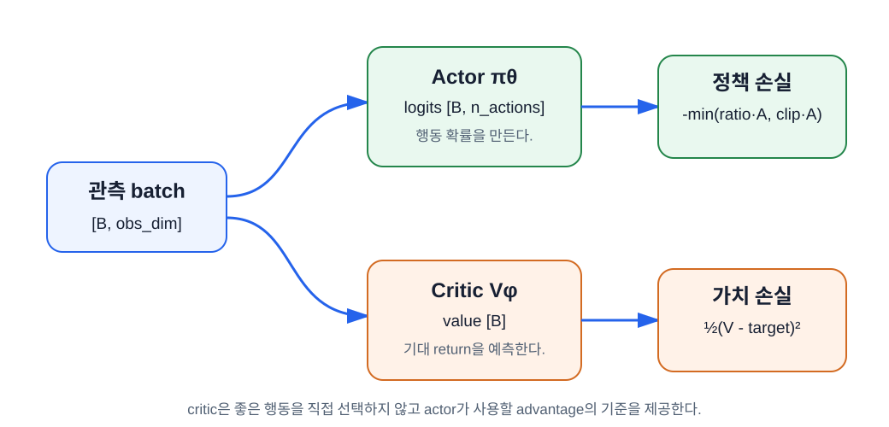

# Policy gradient, actor–critic과 GAE

이 장의 중심 질문은 **“어떤 행동의 확률을 올리거나 내려야 하는지 어떻게 정하는가?”** 다. Berkeley CS 185/285와 Stanford CS234의 policy gradient → variance reduction → actor–critic 흐름을 따른다.

## 학습 목표

이 장을 마치면 다음을 할 수 있다.

1. REINFORCE loss의 `log_prob × return` 구조를 설명한다.
2. baseline을 빼도 정책 gradient의 평균 방향을 바꾸지 않으면서 분산을 줄이는 이유를 직관적으로 말한다.
3. actor와 critic의 역할을 구분한다.
4. TD residual에서 GAE를 역방향으로 계산한다.
5. 자연 종료와 시간 제한에 서로 다른 bootstrap·continuation mask를 적용한다.

## 기대 return을 직접 최적화하기

정책의 목표는 기대 return을 크게 만드는 것이다.

$$
J(\theta)=\mathbb E_{\tau\sim\pi_\theta}[G_0]
$$

여기서 **궤적(trajectory)** 은 한 에피소드의 상태·행동·보상 열이다.

$$
\tau=(s_0,a_0,r_0,s_1,a_1,r_1,\ldots)
$$

초기 상태 분포를 $\rho_0$, 환경 전이 확률을 $P$라 하면 특정 궤적이 나올 확률은 다음 곱이다.

$$
p_\theta(\tau)=\rho_0(s_0)
\prod_{t=0}^{T-1}
\pi_\theta(a_t\mid s_t)P(s_{t+1}\mid s_t,a_t)
$$

초기 상태와 환경 전이에는 actor 파라미터 $\theta$가 없다. $\theta$를 바꿀 때 직접 변하는 부분은 정책 확률뿐이다. 이것이 환경을 미분하지 않고도 정책을 학습할 수 있는 열쇠다.

### Policy gradient를 네 단계로 유도하기

이산적인 모든 가능한 궤적을 합으로 쓴다고 생각하자. 연속인 경우 합이 적분으로 바뀌지만 논리는 같다.

1. 기대 return을 “궤적 확률 × 궤적 return”의 합으로 쓴다.

   $$
   J(\theta)=\sum_\tau p_\theta(\tau)G(\tau)
   $$

2. $G(\tau)$ 자체는 이미 정해진 궤적의 숫자이므로 확률만 미분한다.

   $$
   \nabla_\theta J=\sum_\tau \nabla_\theta p_\theta(\tau)G(\tau)
   $$

3. $\nabla p=p\nabla\log p$인 로그미분 항등식을 넣는다. 그러면 다시 기댓값 꼴이 된다.

   $$
   \nabla_\theta J
   =\mathbb E_{\tau\sim p_\theta}
   [\nabla_\theta\log p_\theta(\tau)G(\tau)]
   $$

4. 곱의 로그는 합이고 환경 항의 미분은 0이므로 정책 로그확률만 남는다.

   $$
   \nabla_\theta\log p_\theta(\tau)
   =\sum_t\nabla_\theta\log\pi_\theta(a_t\mid s_t)
   $$

모든 가능한 궤적을 열거할 수는 없다. 실제로 수집한 유한 개 표본의 평균으로 기댓값을 근사한다. 이렇게 표본으로 알 수 없는 참값을 계산한 값을 **추정치(estimator의 결과)** 라 하며, 식 위의 모자 $\hat{\ }$는 “추정한 값”이라는 표시다.

따라서 로그미분 트릭을 사용하면 샘플 궤적으로 gradient를 추정할 수 있다.

$$
\nabla_\theta J(\theta)
\approx\frac1N\sum_{t=0}^{N-1}
\nabla_\theta\log\pi_\theta(a_t\mid s_t)\hat Q_t
$$

PyTorch optimizer는 최소화하므로 음수를 붙인다.

```python
policy_loss = -(log_probs * returns).mean()
```

이 가장 단순한 Monte Carlo policy gradient를 흔히 **REINFORCE** 라 부른다.

## Causality와 reward-to-go

**인과성(causality)** 은 원인이 결과보다 앞서야 한다는 관계다. 시점 $t$의 행동은 그보다 앞서 받은 reward를 바꿀 수 없다. 그러므로 전체 episode return 대신 그 시점 이후 reward만 누적한 **reward-to-go** $G_t$를 사용한다.

$$
G_t=\sum_{k=t}^{T-1}\gamma^{k-t}r_k
$$

이 변경은 미래에 영향을 줄 수 없는 과거 reward가 gradient 잡음으로 들어오는 것을 막는다.

## Return만 쓰면 왜 흔들리는가

같은 행동이라도 환경 난수와 이후 행동 때문에 return이 크게 달라질 수 있다. 예를 들어 어떤 상태에서 평균적으로 return 100을 얻는 정책이 있다고 하자.

- 행동 A 뒤 return 103: 절대값은 크지만 평균보다 조금 좋다.
- 행동 B 뒤 return 97: 절대값은 여전히 크지만 평균보다 나쁘다.

return 자체만 곱하면 두 행동 모두 확률을 크게 올리는 신호가 된다. 중요한 것은 절대 점수가 아니라 **그 상태에서 평소보다 얼마나 나았는가** 다.

## Baseline과 advantage

상태에만 의존하고 현재 행동에는 의존하지 않는 baseline을 policy gradient에서 빼도 기대 gradient는 바뀌지 않는다. 가장 흔한 baseline이 상태 가치 $V^\pi(s_t)$다.

왜 평균 방향이 그대로인지 한 상태에서 직접 확인할 수 있다. 행동과 무관한 숫자 $b(s)$를 곱한 기대 gradient는

$$
\begin{aligned}
\sum_a\pi_\theta(a\mid s)
\nabla_\theta\log\pi_\theta(a\mid s)b(s)
&=b(s)\sum_a\nabla_\theta\pi_\theta(a\mid s)\\
&=b(s)\nabla_\theta\sum_a\pi_\theta(a\mid s)\\
&=b(s)\nabla_\theta 1=0
\end{aligned}
$$

첫 줄은 $\pi\nabla\log\pi=\nabla\pi$를 썼고, 마지막 줄은 모든 행동 확률의 합이 항상 1이기 때문이다. 따라서 baseline 항의 **기댓값은 0**이다. 개별 표본의 값은 바뀌지만 장기 평균 gradient는 바뀌지 않으며, 좋은 baseline은 흔들림을 줄인다. 단, baseline이 현재 선택 행동에 직접 의존하면 이 결론이 일반적으로 성립하지 않는다.

$$
A^\pi(s_t,a_t)=Q^\pi(s_t,a_t)-V^\pi(s_t)
$$

**Advantage** 는 선택한 행동이 그 상태의 평균적인 행동보다 얼마나 좋았는지를 나타낸다.

- $A_t>0$: 선택 행동의 확률을 올린다.
- $A_t<0$: 선택 행동의 확률을 내린다.
- $A_t\approx0$: 정책 update 기여가 작다.

정책 gradient 추정은 다음이 된다.

$$
\hat g=\frac1N\sum_t
\nabla_\theta\log\pi_\theta(a_t\mid s_t)\hat A_t
$$

## Actor–critic 구조

**Actor** 는 행동분포 $\pi_\theta(a\mid s)$를 출력한다. **Critic** 은 상태 가치 $V_\phi(s)$를 예측해 actor가 사용할 advantage의 기준을 제공한다.



| 구성요소 | 입력 | 출력 | 학습 신호 | 추론 시 필요 |
|---|---|---|---|---|
| actor | 관측 | 행동분포 파라미터 | advantage가 가중한 log probability | 필요 |
| critic | 관측 | 스칼라 가치 | value target과의 회귀 오차 | 보통 불필요 |

critic은 어떤 행동이 최선인지 직접 말하지 않는다. 가치 기준을 제공해 actor gradient의 분산을 줄인다.

## TD residual을 advantage 신호로 쓰기

Bellman 관계를 사용한 한 스텝 TD residual은 다음과 같다.

$$
\delta_t=r_t+\gamma b_tV_\phi(s_{t+1})-V_\phi(s_t)
$$

$b_t$는 bootstrap mask다.

- 자연 종료: $b_t=0$
- 계속 또는 시간 제한: $b_t=1$

$\delta_t>0$이면 실제 한 스텝 결과가 critic 기대보다 좋았다는 뜻이다. 이를 한 스텝 advantage 추정으로 사용할 수 있지만, critic 예측 하나의 오류에 민감하다.

## GAE: 여러 길이의 TD 정보를 섞기

**일반화 advantage 추정(Generalized Advantage Estimation, GAE)** 은 현재 TD residual과 이후 residual을 지수적으로 감쇠해 더한다.

먼저 여러 스텝 advantage가 residual 합으로 어떻게 연결되는지 보자.

$$
\begin{aligned}
\hat A_t^{(1)} &= \delta_t \\
\hat A_t^{(2)} &= \delta_t+\gamma\delta_{t+1} \\
\hat A_t^{(3)} &= \delta_t+\gamma\delta_{t+1}+\gamma^2\delta_{t+2}
\end{aligned}
$$

예를 들어 2-step 식을 펼치면 중간의 $V(s_{t+1})$가 상쇄되어 두 reward 뒤의 가치로 bootstrap하는 형태가 된다.

$$
\delta_t+\gamma\delta_{t+1}
=r_t+\gamma r_{t+1}+\gamma^2V(s_{t+2})-V(s_t)
$$

GAE는 한 스텝, 두 스텝, 세 스텝처럼 서로 다른 길이의 advantage 추정을 $\lambda$로 기하급수적으로 가중한 결과와 동등하다.

$$
\hat A_t^{GAE(\gamma,\lambda)}
=\delta_t+(\gamma\lambda)\delta_{t+1}
+(\gamma\lambda)^2\delta_{t+2}+\cdots
$$

역방향 재귀로 계산하면 간단하다.

$$
\hat A_t=\delta_t+\gamma\lambda c_t\hat A_{t+1}
$$

$c_t$는 continuation mask다. episode가 끝나면 다음 episode의 advantage를 현재 episode로 연결하지 않으므로 자연 종료와 시간 제한 모두 $c_t=0$이다.

| 경계 | bootstrap mask $b_t$ | continuation mask $c_t$ | 뜻 |
|---|---:|---:|---|
| 계속 | 1 | 1 | 다음 가치와 다음 residual을 모두 사용 |
| `terminated` | 0 | 0 | 다음 가치는 0, 재귀도 종료 |
| `truncated` | 1 | 0 | final observation 가치 사용, 다음 episode 재귀는 차단 |
| rollout 끝이지만 episode 계속 | 1 | rollout 밖 advantage는 0 | 마지막 다음 가치로 bootstrap하고 현재 batch에서 재귀 종료 |

!!! important "마스크가 두 개인 이유"
    `truncated` transition은 시간 제한 때문에 episode를 reset하지만 MDP terminal은 아니다. 그래서 다음 가치로 bootstrap한다. 그러나 reset 뒤 새 episode의 advantage가 앞 episode로 섞이면 안 되므로 GAE 재귀는 끊는다.

[GAE 실험실에서 terminated와 truncated 비교하기](./assets/advantage-estimation/gae-lab.html)

## Worked Example: GAE를 뒤에서 계산하기

다음 세 transition을 생각하자. 마지막은 자연 종료다.

| $t$ | $r_t$ | $V(s_t)$ | $V(s_{t+1})$ | terminated |
|---:|---:|---:|---:|---:|
| 0 | 1.0 | 0.5 | 0.6 | 0 |
| 1 | 1.0 | 0.6 | 0.4 | 0 |
| 2 | 1.0 | 0.4 | 0.0 | 1 |

$\gamma=0.9$, $\lambda=0.8$이다. 먼저 residual을 구한다.

$$
\begin{aligned}
\delta_2 &= 1-0.4=0.6 \\
\delta_1 &= 1+0.9(0.4)-0.6=0.76 \\
\delta_0 &= 1+0.9(0.6)-0.5=1.04
\end{aligned}
$$

이제 $\gamma\lambda=0.72$로 뒤에서 재귀한다.

$$
\begin{aligned}
\hat A_2 &= 0.6 \\
\hat A_1 &= 0.76+0.72(0.6)=1.192 \\
\hat A_0 &= 1.04+0.72(1.192)=1.89824
\end{aligned}
$$

critic이 학습할 value target은 $\hat V^{target}_t=\hat A_t+V(s_t)$다.

```text
value_targets ≈ [2.39824, 1.792, 1.0]
```

## GAE 코드

책의 [핵심 수식 구현](./examples/ppo_components.py)은 종료 의미를 보존한다.

```python
for index in reversed(range(rewards.shape[0])):
    bootstrap_mask = (~terminated[index]).float()
    continuation_mask = (~(terminated[index] | truncated[index])).float()

    delta = (
        rewards[index]
        + gamma * bootstrap_mask * next_values[index]
        - values[index]
    )
    next_advantage = (
        delta
        + gamma * gae_lambda * continuation_mask * next_advantage
    )
    advantages[index] = next_advantage

value_targets = advantages + values
```

advantage와 value target은 rollout 데이터에서 계산한 target이므로 actor·critic 파라미터로 gradient가 흘러가게 만들지 않는다.

## $\lambda$의 bias–variance 손잡이

- $\lambda=0$: $\hat A_t=\delta_t$. 한 스텝 bootstrap 비중이 커서 분산은 낮지만 critic 편향에 민감하다.
- $\lambda\to1$: 더 긴 미래 residual을 반영한다. Monte Carlo에 가까워져 편향은 줄 수 있지만 분산이 커진다.

이 설명은 방향을 잡기 위한 일반적 직관이지 모든 문제에서의 단조로운 보장은 아니다. Critic 오류, 유한 rollout 경계, advantage 표준화가 함께 작용하므로 실제 편향과 분산은 실험으로 확인한다.

`gamma`와 `lambda`는 역할이 다르다.

| 파라미터 | 무엇을 정하는가? |
|---|---|
| $\gamma$ | 문제의 미래 reward를 얼마나 중요하게 볼지 |
| $\lambda$ | advantage 추정에서 여러 시간 길이를 어떻게 섞을지 |

보통 시작값으로 $\gamma=0.99$, $\lambda=0.95$를 자주 보지만 환경 시간 규모에 맞게 실험해야 한다.

## Entropy는 탐색 정도를 보여준다

확률정책의 **entropy** 는 행동분포의 불확실성이다.

$$
H(\pi(\cdot\mid s))=-\sum_a\pi(a\mid s)\log\pi(a\mid s)
$$

`[0.5,0.5]`는 `[0.99,0.01]`보다 entropy가 크다. loss에서 entropy bonus를 사용하면 너무 이르게 한 행동만 고르는 것을 늦출 수 있다.

```python
loss = policy_loss + value_coef * value_loss - entropy_coef * entropy
```

최소화 loss이므로 entropy 앞에 음수가 붙는다. entropy를 크게 만들수록 total loss가 작아진다.

## 구현 전 불변조건

다음은 update 전에 assertion으로 확인할 가치가 있다.

```python
assert advantages.shape == values.shape == rewards.shape
assert not advantages.requires_grad
assert torch.isfinite(advantages).all()
assert torch.isfinite(value_targets).all()
```

수치가 유한하고 shape가 맞지 않으면 PPO clipping을 조정하기 전에 GAE와 환경 데이터를 먼저 고친다.

## 흔한 오류

| 오류 | 결과 | 수정 |
|---|---|---|
| reward와 return을 같은 말로 사용 | critic target 의미 혼동 | 한 스텝 `reward`, 미래 누적 `return`으로 고정 |
| `terminated or truncated`를 bootstrap mask로 사용 | truncation에서 미래 가치 손실 | bootstrap mask는 `~terminated` |
| truncation에서 GAE 재귀도 유지 | reset된 다음 episode가 섞임 | continuation mask는 `~(terminated | truncated)` |
| advantage에 gradient 연결 | actor loss가 critic target 계산까지 역전파 | rollout target을 gradient-free로 계산 |
| actor와 critic 역할 혼동 | critic 출력으로 행동을 직접 선택 | actor만 행동분포 생성 |
| entropy 부호 반대 | 탐색을 장려하려다 억제 | 최소화 loss에서 `- entropy_coef * entropy` |

## 연습문제

1. $r=2$, $V(s)=1.5$, $V(s')=2$, $\gamma=0.9$, 계속 transition의 $\delta$를 계산하라.
2. 1번이 `terminated=True`라면 $\delta$를 다시 계산하라.
3. `truncated=True`일 때 bootstrap mask와 continuation mask를 써라.
4. $\delta=[1,2]$, $\gamma\lambda=0.5$, 마지막에 자연 종료일 때 $A_1,A_0$을 계산하라.
5. policy entropy가 학습 초기에 바로 0에 가까워졌다면 어떤 위험을 의심할 수 있는가?

??? note "정답 확인"
    1번: $2+0.9(2)-1.5=2.3$. 2번: $2-1.5=0.5$. 3번: bootstrap 1, continuation 0. 4번: $A_1=2$, $A_0=1+0.5(2)=2$. 5번: 정책이 탐색 전에 거의 결정론적으로 붕괴했을 수 있다.

## 대학 강의와 참고문헌

- [UC Berkeley CS 185/285 Section 3: Policy Gradients and Actor-Critic](https://rail.eecs.berkeley.edu/deeprlcourse/static/sections/section-3.pdf)
- [Stanford CS234: Policy Gradient lecture block](https://web.stanford.edu/class/cs234/modules.html)
- Schulman et al. (2015), [*High-Dimensional Continuous Control Using Generalized Advantage Estimation*](https://arxiv.org/abs/1506.02438)
- [TorchRL `GAE` API](https://docs.pytorch.org/rl/stable/reference/generated/torchrl.objectives.value.GAE.html)

[← 3장](./03-pytorch-for-policies.md) · [목차](./index.md) · [5장: PPO-Clip 목적함수 →](./05-ppo-clipped-objective.md)
