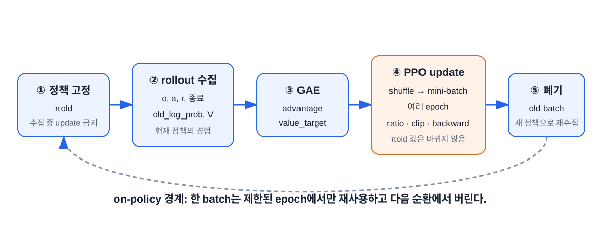

# 순수 PyTorch로 PPO 만들기

이 장의 중심 질문은 **“앞 장의 수식이 실제 학습 코드의 어느 줄에 대응하는가?”** 다. 완성 예제를 실행한 뒤 수집, GAE, update, 평가의 경계를 따라 읽는다.

## 학습 목표

이 장을 마치면 다음을 할 수 있다.

1. 핵심 수식 단위 테스트와 CartPole PPO smoke test를 실행한다.
2. rollout buffer의 각 tensor를 Gymnasium transition에 대응한다.
3. 수집 중 저장한 old 값과 update 중 다시 계산하는 new 값을 구분한다.
4. GAE와 PPO update 루프의 shape를 추적한다.
5. 학습한 actor를 결정론적으로 평가하고 체크포인트를 복원한다.

## 예제 구조

```text
examples/
├─ ppo_components.py   # return, GAE, clipped objective, explained variance
├─ ppo_cartpole.py     # 전체 학습·평가·저장 프로그램
├─ plot_metrics.py     # CSV 학습 로그를 SVG 곡선으로 변환
└─ torchrl_ppo.py      # 8장에서 사용할 TorchRL 버전
tests/
└─ test_ppo_components.py
requirements.txt
```

핵심 파일은 [ppo_cartpole.py](./examples/ppo_cartpole.py)다. 한 파일에 모든 학습 흐름이 있지만 수학 함수는 테스트를 위해 [ppo_components.py](./examples/ppo_components.py)로 분리했다.

## 먼저 빠른 검증을 실행한다

책 폴더로 이동하고 가상환경을 활성화한다.

```powershell
cd docs\pytorch-ppo-learning
.\.venv-ppo\Scripts\Activate.ps1
```

**단위 테스트(unit test)** 는 함수 하나처럼 작은 단위의 입력과 기대 출력을 비교한다. **Smoke test**는 프로그램 전체의 가장 짧은 경로를 실행해 큰 연결 오류가 없는지 본다. **End-to-end test**는 실제 사용 흐름을 처음부터 끝까지 검증한다. 이 책의 smoke test에는 짧은 학습과 평가·저장이 들어가지만, 짧기 때문에 성능 수렴까지 보장하는 완전한 실험 검증은 아니다.

핵심 수식 단위 테스트를 실행한다.

```powershell
python -m unittest discover -s tests -v
```

테스트는 다음 네 계약을 확인한다.

1. discounted return의 역방향 계산
2. 자연 종료에서 다음 가치 제거
3. 시간 제한에서 bootstrap 유지와 GAE 재귀 차단
4. advantage 부호별 PPO clipping

짧은 end-to-end smoke test를 실행한다.

```powershell
python examples\ppo_cartpole.py --smoke-test
```

Smoke test는 512 transition만 사용하므로 CartPole 해결이 목표가 아니다. 예외 없이 수집, update, 평가, 체크포인트 저장을 한 바퀴 도는지 확인한다.

## 전체 학습 실행

```powershell
python examples\ppo_cartpole.py --total-steps 100000 --seed 42
```

학습 지표를 나중에 그릴 CSV 파일에도 저장할 수 있다.

```powershell
python examples\ppo_cartpole.py `
    --total-steps 100000 `
    --seed 42 `
    --eval-interval 10 `
    --metrics-csv metrics\baseline-seed42.csv

python examples\plot_metrics.py `
    metrics\baseline-seed42.csv `
    --output metrics\baseline-seed42.svg
```

**CSV(Comma-Separated Values)** 는 첫 줄에 열 이름을 두고 각 행의 값을 쉼표로 구분한 텍스트 표 형식이다. 스프레드시트나 Python에서 다시 분석하기 쉽다. SVG는 확대해도 선이 깨지지 않는 벡터 그림 형식이다.

CartPole은 확률적 초기 상태와 행동 샘플링 때문에 실행마다 곡선이 다르다. 한 seed가 500에 도달했다고 알고리즘이 검증된 것은 아니다. 7장에서 여러 seed를 비교한다.

## 프로그램의 다섯 단계



`train()`의 바깥 반복 한 번은 다음 작업을 수행한다.

```text
1. 현재 정책으로 rollout_steps만큼 수집
2. rollout의 GAE와 value target 계산
3. advantage 표준화
4. 여러 epoch × mini-batch로 actor와 critic update
5. 로그 기록 후 다음 rollout으로 이동
```

수집과 update가 섞이지 않는 것이 핵심이다.

## 1단계: 환경과 모델 구성

`Config`는 실행 중 바꿀 설정을 한곳에 모은 **dataclass**다. Dataclass는 이름 있는 데이터 필드와 기본값을 간단히 선언하게 해 주는 Python 기능이다. **Hyperparameter(하이퍼파라미터)** 는 gradient로 학습되는 weight가 아니라 사람이 학습 전에 정하는 설정이다.

| 설정 | 기본값 | 의미 |
|---|---:|---|
| `env_id` | `CartPole-v1` | Gymnasium 환경 이름 |
| `seed` | 42 | 난수 생성의 시작 상태 |
| `total_steps` | 100,000 | 전체 환경 transition 예산 |
| `rollout_steps` | 1,024 | 정책 update 한 번 전 수집량 |
| `update_epochs` | 10 | rollout을 반복 학습하는 횟수 |
| `minibatch_size` | 64 | optimizer step당 표본 수 |
| `learning_rate` | $3\times10^{-4}$ | Adam의 기본 보폭 |
| `gamma` | 0.99 | reward 할인율 |
| `gae_lambda` | 0.95 | GAE 길이 혼합 계수 |
| `clip_epsilon` | 0.2 | PPO ratio clip 반폭 |
| `value_coef` | 0.5 | total loss의 critic 가중치 |
| `entropy_coef` | 0.01 | entropy bonus 가중치 |
| `max_grad_norm` | 0.5 | gradient norm 상한 |
| `target_kl` | 0.03 | epoch 조기 중단 기준 |
| `hidden_size` | 64 | MLP 은닉층의 neuron 수 |
| `eval_episodes` | 10 | 한 번의 분리 평가 episode 수 |
| `eval_interval` | 0 | 0은 마지막만, 양수는 해당 update 간격으로 평가 |
| `checkpoint` | `ppo_cartpole.pt` | 모델 저장 경로 |
| `metrics_csv` | `None` | 지정할 경우 update별 로그 경로 |
| `device` | `auto` | CPU·CUDA 선택 |

```python
env = gym.make(config.env_id)
observation, _ = env.reset(seed=config.seed)
env.action_space.seed(config.seed)

model = build_model(env, config, device)
optimizer = torch.optim.Adam(
    model.parameters(),
    lr=config.learning_rate,
    eps=1e-5,
)
```

예제는 rollout을 마칠 때마다 학습률을 시작값에서 0 방향으로 선형 감소시킨다. 학습 초반에는 비교적 크게 배우고 후반에는 더 조심스럽게 움직이려는 **learning-rate annealing**이다. PPO의 필수 정의가 아니라 흔한 안정화 선택이며, 비교 실험에서는 이 일정도 같은 조건으로 고정한다.

`build_model()`은 환경 계약을 먼저 확인한다.

```python
if not isinstance(env.action_space, gym.spaces.Discrete):
    raise TypeError("이 교육용 구현은 Discrete action space만 지원합니다.")
```

이 코드는 모든 환경에 일반적인 PPO가 아니다. `Categorical`을 사용하는 discrete action 교육용 구현이다. 연속 행동은 8장의 `TanhNormal` 구조가 필요하다.

## 2단계: ActorCritic

`ActorCritic`은 파라미터를 공유하지 않는 actor와 critic MLP를 가진다.

```python
class ActorCritic(nn.Module):
    def distribution(self, observations):
        return Categorical(logits=self.actor(observations))

    def value(self, observations):
        return self.critic(observations).squeeze(-1)
```

분리된 네트워크는 계산량이 조금 늘지만 초심자가 두 손실의 역할과 gradient를 구분하기 쉽다.

각 `Linear`의 weight는 **orthogonal initialization(직교 초기화)** 로 시작한다. 행 또는 열 방향이 서로 겹치지 않도록 초기 weight를 구성해 신호 크기가 층을 지나며 지나치게 찌그러지는 것을 줄이는 초기화 방법이다. 학습의 필수 정의는 아니고 흔한 안정화 선택이다. Actor 마지막 층의 scale을 `0.01`로 작게 두면 초기 logits가 0 근처여서 두 행동 확률이 거의 균등하게 시작한다. Critic 마지막 층은 `1.0`을 사용한다. 이 숫자들은 이론적으로 유일한 값이 아니라 실험 가능한 구현 설정이다.

`action_and_value()`는 수집과 update에서 같은 확률 계산을 재사용한다.

```python
def action_and_value(self, observations, actions=None):
    distribution = self.distribution(observations)
    if actions is None:
        actions = distribution.sample()
    return (
        actions,
        distribution.log_prob(actions),
        distribution.entropy(),
        self.value(observations),
    )
```

- 수집: `actions=None`이므로 새 행동을 샘플링한다.
- update: buffer의 `actions`를 넣어 같은 행동의 새 로그확률을 구한다.

## 3단계: rollout buffer

**Buffer(버퍼)** 는 나중 계산을 위해 데이터를 잠시 보관하는 공간이다. 교육용 구현은 복잡한 buffer class 대신 같은 첫 차원을 가진 tensor dictionary를 쓴다.

| 키 | shape | 수집 시 의미 | update에서의 역할 |
|---|---|---|---|
| `observations` | `[T, 4]` | 행동 전 관측 | actor·critic 입력 |
| `actions` | `[T]` | old 정책 샘플 | new log probability의 대상 |
| `old_log_probs` | `[T]` | old 정책의 선택 행동 로그확률 | ratio 분모 |
| `rewards` | `[T]` | 한 스텝 보상 | TD 잔차 |
| `terminated` | `[T]` bool | 자연 종료 | bootstrap mask |
| `truncated` | `[T]` bool | 시간 제한 | GAE continuation mask |
| `values` | `[T]` | $V(s_t)$ | TD 잔차, value target |
| `next_values` | `[T]` | $V(s_{t+1})$ | bootstrap |
| `advantages` | `[T]` | GAE 결과 | policy loss |
| `value_targets` | `[T]` | $\hat A_t+V(s_t)$ | critic loss |

$T$는 `rollout_steps`다.

## 수집에서 gradient를 끈다

```python
with torch.inference_mode():
    action, log_prob, _, value = model.action_and_value(observation_tensor)
```

이때 `log_prob`은 나중에 바뀌면 안 되는 old 데이터다. `inference_mode()` 덕분에 계산 그래프가 저장되지 않는다.

환경 step 뒤 다음 가치를 계산한다.

```python
if terminated:
    next_value = torch.zeros((), device=device)
else:
    next_value = model.value(next_observation_tensor)
```

`truncated=True`여도 `terminated=False`이므로 final observation의 가치로 bootstrap한다. 그 뒤에는 reset한다.

```python
episode_finished = terminated or truncated
if episode_finished:
    current_observation, _ = env.reset()
```

Reset용 mask와 bootstrap용 mask가 다르다는 점을 코드가 직접 보여준다.

## GAE를 buffer에 추가한다

수집이 끝나면 [핵심 수식 함수](./examples/ppo_components.py)를 호출한다.

```python
advantages, value_targets = generalized_advantage_estimate(
    rewards=rollout["rewards"],
    values=rollout["values"],
    next_values=rollout["next_values"],
    terminated=rollout["terminated"],
    truncated=rollout["truncated"],
    gamma=config.gamma,
    gae_lambda=config.gae_lambda,
)
```

함수는 shape가 모두 같은지 검사하고 역방향으로 계산한다. 작은 함수로 분리했기 때문에 환경을 수천 스텝 실행하지 않고도 종료 같은 **경계 사례(edge case)** 를 테스트할 수 있다.

## Advantage 표준화

Update 전에 현재 rollout 전체에서 표준화한다.

```python
advantages = rollout["advantages"]
rollout["advantages"] = (
    (advantages - advantages.mean())
    / (advantages.std(unbiased=False) + 1e-8)
)
```

표준화는 정책 update의 scale을 안정화하는 구현 선택이다. 원래 값은 critic target을 만들 때 이미 사용했으므로 value target을 함께 표준화하지 않는다.

## Mini-batch PPO update

각 epoch에서 index를 새로 섞는다.

```python
indices = torch.arange(batch_size, device=device)
permutation = indices[torch.randperm(batch_size, device=device)]
```

Mini-batch마다 old 행동의 새 로그확률을 구한다.

```python
_, new_log_prob, entropy, new_value = model.action_and_value(
    observations[minibatch],
    actions[minibatch],
)
```

Ratio와 clipped policy loss는 5장 식 그대로다.

```python
log_ratio = new_log_prob - old_log_probs[minibatch]
ratio = torch.exp(log_ratio)

unclipped = ratio * advantages[minibatch]
clipped = torch.clamp(
    ratio, 1.0 - clip_epsilon, 1.0 + clip_epsilon
) * advantages[minibatch]

policy_loss = -torch.minimum(unclipped, clipped).mean()
```

Critic은 value target으로 회귀한다.

```python
value_loss = 0.5 * (
    new_value - value_targets[minibatch]
).pow(2).mean()
```

Total loss와 optimizer 순서는 다음이다.

```python
loss = (
    policy_loss
    + value_coef * value_loss
    - entropy_coef * entropy.mean()
)

optimizer.zero_grad(set_to_none=True)
loss.backward()
grad_norm = nn.utils.clip_grad_norm_(model.parameters(), max_grad_norm)
optimizer.step()
```

## KL 조기 중단

한 epoch의 approximate KL 평균이 설정값을 넘으면 나머지 epoch를 멈춘다.

```python
approx_kl = ((ratio - 1.0) - log_ratio).mean()

if np.mean(epoch_kl_values) > config.target_kl:
    break
```

이는 PPO-Clip의 필수 정의가 아니라 과도한 update를 추가로 감시하는 안전장치다.

## 로그 한 줄 읽기

예제 출력 형식은 다음과 같다.

```text
update=010/098 steps=0010240 return20= 185.40 entropy=0.611 kl=0.00421 clipfrac=0.073 ev=0.642
```

| 값 | 질문 |
|---|---|
| `return20` | 최근 완료 20 episode의 학습 return이 오르는가? |
| `entropy` | 정책이 너무 빨리 결정론적으로 변하는가? |
| `kl` | old와 current 정책이 한 update에서 너무 멀어지는가? |
| `clipfrac` | ratio가 clip 구간 밖으로 나간 샘플이 얼마나 많은가? |
| `ev` | critic이 value target 변동을 어느 정도 설명하는가? |

학습 return은 stochastic policy가 수집 중 얻은 값이다. 최종 성능은 별도 평가로 판단한다.

`--metrics-csv`를 지정하면 콘솔에 일부만 표시되는 update도 모두 한 행씩 저장한다. `--eval-interval 10`을 함께 쓰면 10 update마다 별도 평가 환경을 실행해 `eval_mean`, `eval_std`도 남긴다. 중간 평가는 환경 상호작용 계산량을 추가로 사용하지만 학습용 `total_steps`에는 섞이지 않는다. `plot_metrics.py`는 여러 CSV의 학습 return, 분리 평가 return, entropy, KL, clip fraction, EV를 한 그림에 겹쳐 seed나 ablation을 비교한다.

## 평가에서는 행동을 고정한다

CartPole discrete 정책 평가는 가장 높은 logit의 index를 돌려주는 **argmax** 행동을 선택한다.

```python
with torch.inference_mode():
    logits = model.actor(observation_tensor)
    action = torch.argmax(logits).item()
```

학습에서는 샘플링해 탐색하고 평가에서는 argmax를 사용한다. 두 결과를 섞어 보고하지 않는다.

```text
evaluation: mean=486.3, std=22.1, episodes=10
```

10 episode 평균 하나도 변동성이 크다. 최종 프로젝트에서는 여러 학습 seed와 seed별 여러 평가 episode를 사용한다.

## 체크포인트 저장과 복원

예제는 모델, optimizer, 설정을 한 dictionary에 저장한다.

```python
torch.save(
    {
        "model_state_dict": model.state_dict(),
        "optimizer_state_dict": optimizer.state_dict(),
        "config": dataclasses.asdict(config),
    },
    path,
)
```

저장한 모델만 평가한다.

```powershell
python examples\ppo_cartpole.py --eval-only --checkpoint ppo_cartpole.pt
```

`map_location`을 사용하므로 GPU에서 저장한 checkpoint도 CPU로 불러올 수 있다.

## 코드 읽기 체크리스트

- [ ] rollout 수집 중 optimizer가 호출되지 않는다.
- [ ] `old_log_probs`는 수집 시점에 저장된다.
- [ ] update에서는 buffer의 action을 사용해 `new_log_prob`을 구한다.
- [ ] natural termination만 next value를 0으로 만든다.
- [ ] truncation은 next value를 사용하지만 GAE 재귀를 끊는다.
- [ ] advantage와 value target에는 gradient가 없다.
- [ ] policy objective에 음수를 붙여 최소화 loss로 바꾼다.
- [ ] old rollout은 update 뒤 다음 반복에서 재사용하지 않는다.

## 직접 수정해 보기

1. `--smoke-test`에서 `print`를 추가해 모든 rollout tensor shape를 출력하라.
2. 첫 mini-batch의 optimizer step 전 `ratio.mean()`과 `ratio.std()`를 출력하라. 처음에는 1과 0에 가까워야 한다.
3. `entropy_coef=0`과 `0.01`을 각각 실행해 entropy 곡선 차이를 기록하라.
4. `gae_lambda=0`과 `0.95`를 비교하라. 한 seed의 승패보다 곡선 변동과 여러 seed를 본다.
5. `terminated`와 `truncated`를 합친 잘못된 구현을 별도 복사본에서 만들어 단위 테스트가 실패하도록 하라.

## 흔한 실행 문제

| 증상 | 원인 후보 | 확인 |
|---|---|---|
| `No module named gymnasium` | 가상환경 미활성화 또는 설치 누락 | `python -m pip show gymnasium` |
| action dtype 오류 | discrete action을 float로 변환 | buffer dtype이 `torch.long`인지 확인 |
| CUDA device mismatch | 관측이나 index가 CPU에 남음 | 모든 tensor의 `.device` 출력 |
| return이 9~20에서 고정 | 학습 방향·old log probability·GAE 오류 | 단위 테스트와 첫 ratio 확인 |
| 잠깐 해결 후 급락 | update 과대·평가 표본 부족 | KL, clipfrac, 여러 평가 episode 확인 |
| checkpoint 평가가 다름 | 설정이나 모델 구조 불일치 | checkpoint config와 현재 `Config` 비교 |

## 연습문제

1. `rollout_steps=1024`, `minibatch_size=64`, `update_epochs=10`일 때 최대 mini-batch update 수를 구하라.
2. 수집 중 `model.action_and_value` 반환 네 값 중 buffer에 저장하지 않아도 되는 값은 무엇인가?
3. Update에서 action을 새로 샘플링하면 왜 잘못인가?
4. 평가에서 stochastic sampling과 argmax를 각각 쓰면 어떤 서로 다른 질문에 답하는가?
5. Smoke test가 통과했지만 return이 오르지 않는다면 smoke test가 보장하지 않는 것은 무엇인가?

??? note "정답 확인"
    1번: 160. 2번: 이 예제에서는 수집 시 entropy를 저장하지 않는다. 3번: old 정책이 실제 선택한 행동의 확률 변화가 아니라 다른 행동을 비교하게 된다. 4번: sampling은 정책 자체의 평균적 행동 성능, argmax는 가장 가능성 높은 행동의 결정론적 성능을 본다. 5번: 알고리즘의 수렴과 좋은 하이퍼파라미터는 보장하지 않는다.

## 참고문헌

- Schulman et al. (2017), [*Proximal Policy Optimization Algorithms*](https://arxiv.org/abs/1707.06347)
- [PyTorch `torch.distributions`](https://docs.pytorch.org/docs/stable/distributions.html)
- [Gymnasium environment API](https://gymnasium.farama.org/api/env/)
- [CleanRL 단일 파일 PPO 구현](https://github.com/vwxyzjn/cleanrl/blob/master/cleanrl/ppo.py): 추가 구현 세부를 비교할 때 사용

[← 5장](./05-ppo-clipped-objective.md) · [목차](./index.md) · [7장: PPO 실험과 디버깅 →](./07-debug-and-experiment.md)
