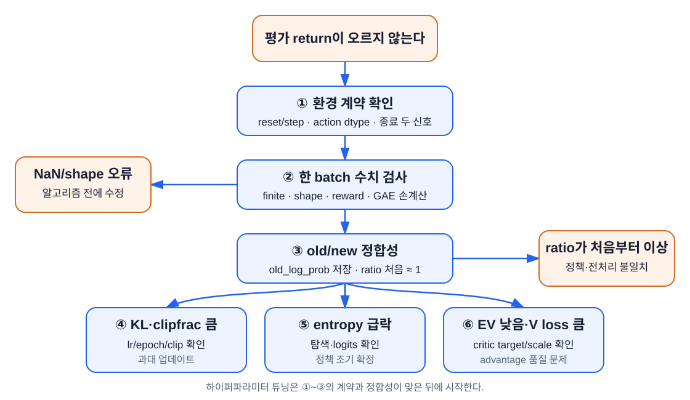

# PPO 실험과 디버깅

이 장의 중심 질문은 **“보상이 오르지 않을 때 무엇부터 확인하는가?”** 다. 강화학습의 무작위 변동과 코드 버그를 구분하고, 한 번에 한 가지만 바꾸는 실험 절차를 만든다.

## 학습 목표

이 장을 마치면 다음을 할 수 있다.

1. 환경 계약 → 수치 → 데이터 정합성 → 최적화 순으로 디버깅한다.
2. return, approximate KL, clip fraction, entropy, value loss, explained variance를 함께 해석한다.
3. 여러 seed를 사용해 우연한 성공과 반복 가능한 개선을 구분한다.
4. 기준 설정과 한 가지 변경 설정의 비교 실험을 설계한다.
5. 버그 수정과 하이퍼파라미터 튜닝을 분리한다.

## PPO는 먼저 계약을 검사한다

먼저 이 장의 실험 용어를 고정한다.

- **기준선(baseline)**: 새 방법이 실제로 나은지 비교할 출발 성능. 여기서는 random policy와 기본 PPO 설정이다. Policy-gradient 식에서 분산을 줄이는 value baseline과 문맥이 다르다.
- **지표(metric)**: return, entropy처럼 학습 상태를 숫자로 요약한 측정값이다.
- **불변조건(invariant)**: 프로그램의 특정 지점에서 항상 참이어야 하는 조건이다. 예: rollout 직후 첫 ratio는 1에 가깝다.
- **Assertion**: 불변조건이 거짓이면 즉시 실행을 멈추는 코드 검사다.
- **실험 프로토콜(protocol)**: seed, step 예산, 평가 episode 수, 행동 선택법처럼 모든 비교에 동일하게 적용할 절차다.
- **Ablation(제거·변경 실험)**: 구성요소 하나만 제거하거나 바꾸어 그 역할을 확인하는 비교다.



Return이 오르지 않는다고 바로 learning rate를 바꾸지 않는다. 다음 순서로 범위를 좁힌다.

1. 환경 API와 종료 의미
2. tensor shape, dtype, finite 값
3. old/current 정책 데이터 정합성
4. update 크기
5. 탐색과 critic 품질

앞 단계가 틀리면 뒤 지표는 원인을 설명하지 못한다.

## 0단계: 무작위 기준선

학습 전에 random policy의 episode return 분포를 측정한다.

```python
import gymnasium as gym
import numpy as np

env = gym.make("CartPole-v1")
returns = []

for episode in range(100):
    observation, _ = env.reset(seed=episode)
    total = 0.0
    finished = False
    while not finished:
        observation, reward, terminated, truncated, _ = env.step(
            env.action_space.sample()
        )
        total += reward
        finished = terminated or truncated
    returns.append(total)

print(np.mean(returns), np.std(returns))
env.close()
```

학습 정책이 이 기준보다 나아지지 않으면 학습 신호 자체를 먼저 의심한다. 숫자는 플랫폼·seed에 따라 달라지므로 고정 정답으로 쓰지 않는다.

## 1단계: 환경 계약

한 episode만 사람이 읽을 수 있게 출력한다.

```python
print(
    observation.shape,
    action,
    reward,
    terminated,
    truncated,
)
```

확인한다.

- `reset()` 뒤에만 첫 `step()`을 호출하는가?
- action이 `Discrete(2)` 범위의 Python 정수인가?
- 자연 종료와 시간 제한을 따로 저장하는가?
- episode 끝에서 정확히 한 번 reset하는가?
- reward가 예상 범위인가?

환경 계약 오류가 있으면 신경망을 빼고 random action loop부터 수정한다.

## 2단계: 작은 수식 테스트

전체 학습은 느리고 원인이 많다. GAE와 clipping은 작은 숫자로 독립 테스트한다.

```powershell
python -m unittest discover -s tests -v
```

추가할 경계 테스트 후보는 다음과 같다.

- rollout 마지막이 계속 transition인 경우
- 첫 transition이 바로 terminated인 경우
- truncated final observation의 가치가 큰 경우
- advantage가 정확히 0인 경우
- ratio가 정확히 $1-\epsilon$, $1+\epsilon$인 경우

단위 테스트는 학습 성공을 보장하지 않지만 수식 구현 오류를 빠르게 배제한다. 단 clipping 테스트의 대상은 `ppo_components.clipped_surrogate()`이고 학습 경로는 같은 식을 `update_model()` 안에 다시 쓰므로, 학습 코드의 clipping은 아래 3·4단계 검사로 확인한다.

## 3단계: Tensor 불변조건

첫 rollout에만 assertion을 넣는다.

```python
assert observations.shape == (rollout_steps, 4)
assert actions.shape == old_log_probs.shape == rewards.shape
assert actions.dtype == torch.long
assert terminated.dtype == truncated.dtype == torch.bool

for name, tensor in rollout.items():
    if tensor.is_floating_point():
        assert torch.isfinite(tensor).all(), name
```

**Finite(유한)** 값은 양·음의 무한대와 정의되지 않은 값을 제외한 정상 실수다. `NaN`은 `0/0`처럼 정의되지 않은 계산에서 생기는 “Not a Number”, `Inf`는 표현 범위를 넘거나 0으로 나눈 결과의 무한대다. 하나라도 loss에 섞이면 대개 weight 전체로 전파되므로 최초 발생 지점을 찾는다.

또한 다음 요약을 기록한다.

```python
print("reward", rewards.min().item(), rewards.max().item())
print("value", values.mean().item(), values.std().item())
print("adv", advantages.mean().item(), advantages.std().item())
```

표준화 뒤 advantage 평균은 0, 표준편차는 1에 가까워야 한다.

## 4단계: Old/current 정합성

첫 optimizer step **전** 같은 모델과 관측, 행동으로 계산한 ratio는 1이어야 한다.

```python
with torch.inference_mode():
    _, new_log_prob, _, _ = model.action_and_value(observations, actions)
    ratio = torch.exp(new_log_prob - old_log_probs)

print(ratio.mean().item(), ratio.std().item())
```

기대값은 대략 `1.0, 0.0`이다. 그렇지 않으면 다음을 확인한다.

- 수집과 update에서 같은 모델 파라미터인가?
- observation normalization이 같게 적용되는가?
- old log probability가 선택한 같은 action의 값인가?
- dropout이나 BatchNorm의 train/eval 모드가 달라졌는가?
- old tensor가 update 중 덮어써졌는가?

## 핵심 지표를 조합해 읽기

단일 지표로 결론 내리지 않는다.

| 지표 | 대체로 좋은 방향 | 위험 신호 | 함께 볼 값 |
|---|---|---|---|
| 평가 return | 여러 seed에서 상승 | 한 seed만 급등하거나 급락 | 학습 return, episode 수 |
| approximate KL | 작고 완만 | 갑작스러운 큰 증가 | clip fraction, learning rate |
| clip fraction | 0과 1 사이에서 변화 | 계속 0 또는 매우 높음 | KL, policy loss |
| entropy | 점진적 감소 가능 | 초기에 거의 0, 또는 끝까지 최대 | return, action 확률 |
| value loss | 학습 중 안정화 가능 | 폭발·NaN | reward scale, value target |
| explained variance | 1에 가까울수록 좋음 | 오래 음수 또는 0 근처 | value loss, advantage scale |
| gradient norm | 유한하고 반복 가능 | NaN/Inf, 매번 clip 한계 초과 | loss 각 항, learning rate |

**Explained variance** 는 critic 예측이 value target 변동을 얼마나 설명하는지 본다.

$$
EV=1-\frac{\operatorname{Var}(y-\hat y)}{\operatorname{Var}(y)}
$$

분자의 $y-\hat y$는 value target과 critic 예측 사이의 **회귀 잔차**다. `explained_variance()`는 이 잔차의 분산을 target 자체의 분산과 비교한다. 이는 한 transition의 TD target으로 계산한 TD 잔차 $\delta_t$와 관련은 있지만 같은 배열은 아니다. 이 구현에서 $y$는 GAE로 만든 `value_target`, $\hat y$는 update 뒤 critic 예측이다.

- 1: target 변동을 잘 설명
- 0: 평균 예측과 비슷한 수준
- 음수: 단순 평균보다도 나쁜 예측 가능

학습 초기에 낮은 것은 정상일 수 있다. 또 target 분산 $\operatorname{Var}(y)$가 0에 매우 가까우면 분모가 작아 EV가 수치적으로 불안정해진다. 예제의 `explained_variance()`는 분산이 정확히 0이면 정의할 수 없다는 뜻으로 `nan`을 반환하므로, 로그의 EV 칸에 `nan`이 보이면 버그가 아니라 이 경우다. 짧은 rollout에서 target이 거의 같은 값이면 return이 좋아도 EV가 음수가 될 수 있다. **높은 return과 낮은 EV는 논리적 모순이 아니다.** EV는 정책 성능이 아니라 그 batch에서 critic이 target의 변동을 설명한 정도이므로 value loss, target 분산, 여러 update의 추세를 함께 본다.

## 증상별 진단

### Return이 전혀 오르지 않는다

우선순위:

1. policy loss 부호
2. old log probability 보존
3. action dtype과 shape
4. GAE 손계산과 종료 mask
5. optimizer가 actor 파라미터를 포함하는지
6. gradient가 유한하고 0이 아닌지

### KL과 clip fraction이 즉시 커진다

가능한 원인:

- learning rate가 큼
- update epoch가 많음
- mini-batch가 지나치게 작음
- advantage scale가 비정상
- old/current 전처리 불일치

계약이 맞는 것을 확인한 뒤 learning rate나 epoch를 낮춘다.

### KL과 clip fraction이 계속 0이다

가능한 원인:

- actor gradient가 흐르지 않음
- advantage가 모두 0
- optimizer에 actor 파라미터 누락
- learning rate가 0 또는 지나치게 작음
- new log probability도 `inference_mode`에서 계산

### Entropy가 너무 빨리 0에 가까워진다

가능한 원인:

- learning rate·epoch 과대
- entropy coefficient가 너무 작음
- 초기 logits가 한 행동에 과도하게 치우침
- reward나 advantage scale가 큼

Entropy coefficient만 먼저 올리기보다 policy update 크기와 초기 분포를 같이 본다.

### Critic loss가 커지고 explained variance가 음수다

가능한 원인:

- value target 계산 오류
- truncation bootstrap 오류
- reward scale 변화
- critic learning rate·capacity 문제
- policy와 critic loss의 shape broadcasting 오류

먼저 한 trajectory의 value target을 손으로 대조한다.

여기서 모델의 **capacity(표현 용량)** 는 network가 표현할 수 있는 함수의 복잡도다. 은닉층 폭이나 깊이가 너무 작으면 target 관계를 표현하지 못할 수 있지만, CartPole에서는 코드·target 오류를 배제하기 전에 무조건 network부터 키우지 않는다.

## Seed는 무엇을 고정하는가

**Seed(난수 시드)** 는 의사난수 생성기가 시작할 상태를 정하는 정수다. 같은 seed는 무작위 선택 열을 재현하는 데 도움을 주지만, 학습을 무작위가 아닌 것으로 바꾸지는 않는다. **결정론적(deterministic)** 실행은 같은 입력과 상태에서 항상 같은 출력을 내는 성질이고, **재현성(reproducibility)** 은 다른 사람이 기록된 코드·버전·절차로 유사한 결론을 얻을 수 있는 더 넓은 개념이다.

다음 난수원이 따로 있다.

- Python `random`
- NumPy
- PyTorch CPU와 CUDA
- Gymnasium environment 초기 상태
- action space
- GPU 연산의 비결정성

예제는 주요 seed를 설정하지만 모든 하드웨어에서 bit 단위 동일성을 보장하지 않는다. 강화학습 재현은 보통 **같은 코드와 설정에서 여러 독립 seed의 성능 분포가 유사한가**로 평가한다.

학습 중 actor는 확률분포에서 행동을 sample해 탐색한다. 이 책의 기본 평가는 가장 큰 logit의 행동을 택하는 deterministic 평가다. 둘은 서로 다른 질문에 답한다.

| 방식 | 행동 선택 | 답하는 질문 |
|---|---|---|
| 학습 rollout | 확률적 sampling | 탐색을 포함한 현재 정책이 어떤 데이터를 만드는가? |
| stochastic 평가 | 확률적 sampling | 정책분포 자체의 평균 성능은 어떤가? |
| deterministic 평가 | argmax | 가장 선호하는 행동만 택할 때 성능은 어떤가? |

평가 방식을 중간에 바꾸면 공정한 비교가 아니므로 protocol에 명시한다.

## 여러 seed 실험

PowerShell에서 세 seed를 순차 실행한다.

```powershell
1, 2, 3 | ForEach-Object {
    python examples\ppo_cartpole.py `
        --seed $_ `
        --total-steps 100000 `
        --checkpoint "ppo_cartpole_seed$_.pt"
}
```

최소 보고 항목:

| 설정 | 학습 seed | seed별 평가 episode | 보고 값 |
|---|---:|---:|---|
| 기준 PPO | 3 이상 | 10 이상 | seed별 평균과 전체 평균·표준편차 |
| 변경 PPO | 같은 seed 집합 | 같은 평가 seed | 같은 값과 차이 |

가능하면 5~10개 학습 seed를 사용한다. 계산 예산이 작다면 3개를 최소로 하고 한계를 명시한다.

### 평균, 표준편차와 신뢰구간

**평균(mean)** 은 대표적인 중심을, **표준편차(standard deviation)** 는 seed 결과가 서로 얼마나 흩어졌는지를 요약한다. Seed 수가 $n$일 때 평균 추정의 흔들림을 나타내는 **표준오차(standard error)** 는 $s/\sqrt n$이다. 표본이 충분하고 조건이 맞을 때 평균의 95% 신뢰구간을 대략 `평균 ± 1.96 × 표준오차`로 표시하기도 한다.

신뢰구간은 “개별 실행의 95%가 이 안에 있다”는 뜻이 아니다. 반복해서 같은 절차로 구간을 만들 때 장기적으로 참 평균을 포함하는 비율에 대한 개념이다. Seed가 3개뿐이면 정규근사 구간이 특히 불안정하므로 seed별 원자료 점을 반드시 함께 보여 주고, 구간을 정밀한 보증처럼 해석하지 않는다.

## 한 번에 한 변수만 바꾼다

첫 비교 실험 후보:

| 질문 | 기준 | 변경 | 기대 관찰 |
|---|---:|---:|---|
| GAE 효과 | $\lambda=0.95$ | $\lambda=0$ | 곡선 분산과 critic 의존 차이 |
| clip 폭 | $\epsilon=0.2$ | $0.1$ | clip fraction, KL, 학습 속도 |
| update 양 | epoch 10 | epoch 3 | KL·sample 재사용과 성능 |
| entropy bonus | 0.01 | 0 | entropy 감소 속도 |
| learning rate | $3\times10^{-4}$ | $10^{-3}$ | update 과대 위험 |

두 개 이상을 동시에 바꾸면 결과 원인을 분리할 수 없다.

Gradient로 학습되는 weight와 달리 learning rate, $\lambda$, clip 폭처럼 사람이 정한 설정을 **하이퍼파라미터(hyperparameter)** 라 한다. 여러 값을 시험해 가장 좋은 결과만 보고하면 우연히 그 평가에 맞은 값을 고를 수 있다. 탐색에 쓴 실행과 최종 보고용 실행을 분리하고 모든 시도 횟수를 기록한다.

## 실험 기록 양식

```text
질문:
가설:
고정한 요소:
바꾼 요소:
학습 seed:
평가 방법:
성공 기준:

결과:
- 평가 return 평균 ± 표준편차
- entropy 패턴
- approximate KL과 clip fraction
- value loss와 explained variance

해석:
한계:
다음 실험:
```

대학 강의의 coding assignment처럼 입력·출력 행동과 평가 기준을 먼저 정하고 코드를 바꾼다.

## 하이퍼파라미터를 조정하는 순서

계약과 수식이 맞는 상태에서 다음 순서를 권장한다.

1. 총 environment step 수가 학습에 충분한지 확인
2. learning rate와 update epoch로 KL 크기 조정
3. rollout과 mini-batch 크기로 추정 분산·update 수 조정
4. $\gamma$, $\lambda$를 환경 시간 규모에 맞춤
5. entropy·value coefficient 조정
6. 네트워크 크기·초기화 조정

CartPole에서 네트워크를 크게 만드는 것은 보통 첫 해결책이 아니다.

## 정리

- 디버깅은 환경 계약 → 작은 수식 테스트 → tensor 불변조건 → old/current 정합성 순으로 좁힌다.
- 지표는 하나씩 보지 않는다. return, approximate KL, clip fraction, entropy, value loss, explained variance를 함께 읽는다.
- 첫 optimizer step 전 ratio는 1에 가까워야 한다. 가장 값싸고 확실한 단위 검사다.
- 한 seed의 성공은 근거가 아니다. 최소 3개, 가능하면 5~10개 seed의 분포로 판단한다.
- 비교 실험은 한 번에 한 변수만 바꾼다. 버그 수정과 하이퍼파라미터 튜닝을 같은 실행에서 섞지 않는다.

## 연습문제

1. Return이 상승하지만 entropy가 첫 update부터 거의 0이라면 성공으로 단정하면 안 되는 이유를 쓰라.
2. 첫 optimizer step 전 ratio 평균이 1.4라면 learning rate를 낮추기 전에 무엇을 확인해야 하는가?
3. `terminated`와 `truncated`를 합친 버그가 value 지표에 어떤 영향을 줄 수 있는가?
4. 기준과 변경 설정을 공정하게 비교할 때 학습 seed와 평가 seed를 어떻게 해야 하는가?
5. 한 seed의 return 500과 세 seed의 `[500, 20, 15]` 중 어느 결과가 더 많은 불확실성을 드러내는가?

??? note "정답 확인"
    1번: 탐색 전에 우연히 한 행동으로 굳어 seed 변화에 취약할 수 있다. 2번: old/current 정책·관측·행동이 일치하고 old log probability가 수집 시 저장됐는지 본다. 3번: 시간 제한에서 value bootstrap을 잃어 critic target이 낮아지고 advantage가 왜곡될 수 있다. 4번: 같은 seed 집합과 같은 평가 프로토콜을 쓴다. 5번: 세 seed 결과가 높은 분산과 불안정을 드러낸다.

## 참고문헌

- [TorchRL: Things to consider when debugging RL](https://docs.pytorch.org/rl/stable/reference/generated/knowledge_base/DEBUGGING_RL.html)
- [CleanRL PPO metrics and implementation details](https://github.com/vwxyzjn/cleanrl/blob/master/docs/rl-algorithms/ppo.md)
- [Stanford CS234 project guidance](https://web.stanford.edu/class/cs234/project.html): 재현성, 평가 방법, 프로젝트 보고서 구조

[← 6장](./06-build-ppo-with-pytorch.md) · [목차](./index.md) · [8장: TorchRL로 PPO 사용하기 →](./08-use-ppo-with-torchrl.md)
