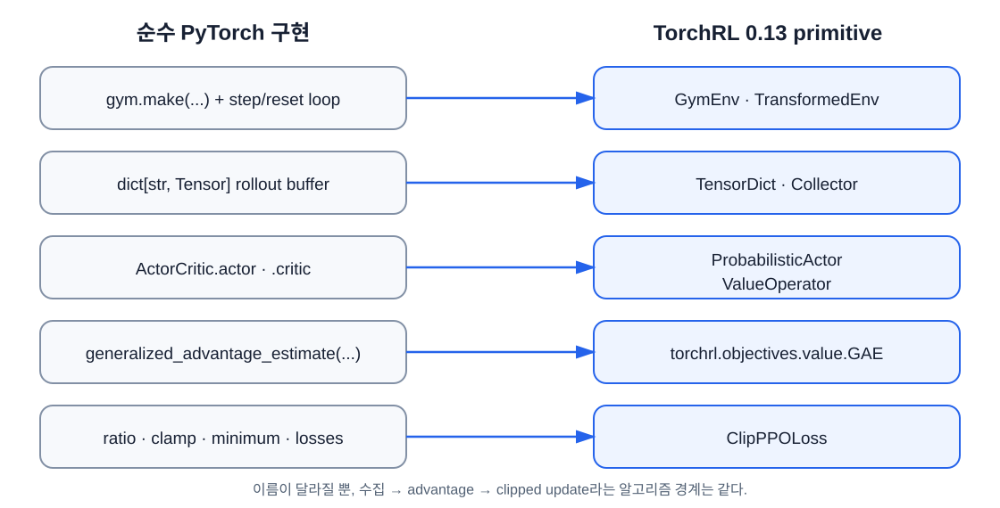

# TorchRL로 PPO 사용하기

이 장의 중심 질문은 **“직접 만든 PPO 구성요소를 TorchRL에서는 무엇이라 부르고 어떻게 조립하는가?”** 다. 6장의 직접 구현을 이해한 상태에서 라이브러리의 추상화를 읽고, 연속 행동 환경에서 PPO를 실행한다.

## 학습 목표

이 장을 마치면 다음을 할 수 있다.

1. `TensorDict`, 환경 spec, transform의 역할을 설명한다.
2. 직접 만든 rollout loop를 collector와 임시 replay buffer에 대응한다.
3. `ProbabilisticActor`, `ValueOperator`, `GAE`, `ClipPPOLoss`를 조립한다.
4. 이산 행동 정책과 연속 행동 정책의 차이를 구분한다.
5. TorchRL 코드에서 자주 생기는 key·shape·버전 오류를 좁힌다.

## 라이브러리를 두 번째로 배우는 이유

6장에서는 buffer, GAE, clipped loss를 직접 작성했다. 덕분에 TorchRL이 숨기는 반복 작업과 유지하는 계약을 구분할 수 있다.

**라이브러리(library)** 는 다른 프로그램이 가져다 쓰는 재사용 코드 묶음이고, **API(Application Programming Interface)** 는 그 기능을 호출할 이름·인자·반환값의 약속이다. 이 장에서 말하는 **primitive(기본 구성요소)** 는 환경, collector, loss처럼 더 큰 학습기를 조립하는 작은 공개 API 객체다. 고수준 trainer가 전체 과정을 숨기는 대신 primitive를 직접 연결해 데이터가 어디서 생기고 사라지는지 확인한다.



| 직접 구현 | TorchRL | 책임 |
|---|---|---|
| `gym.make`, step loop | `GymEnv`, `TransformedEnv` | 환경과 전처리 |
| Python tensor buffer | `TensorDict` | 이름 있는 batch 전달 |
| rollout loop | `Collector` | 현재 정책으로 데이터 수집 |
| actor network + `Categorical` | `ProbabilisticActor` | 행동 분포와 log probability |
| critic network | `ValueOperator` | 상태 가치 출력 |
| GAE 함수 | `GAE` | advantage와 value target |
| PPO loss 함수 | `ClipPPOLoss` | policy·critic·entropy loss |
| shuffled index | `ReplayBuffer` + sampler | rollout의 mini-batch 구성 |

이 장은 TorchRL `0.13` 계열을 기준으로 한다. TorchRL은 발전 속도가 빠르므로 import나 인자 이름이 다르면 먼저 설치 버전과 해당 버전의 문서를 확인한다.

## TensorDict: 이름 있는 Tensor 묶음

직접 구현에서는 `observations`, `actions`, `rewards`를 별도 변수로 들고 다녔다. `TensorDict`는 공통 batch 크기를 가진 tensor를 key로 묶는다.

```text
batch
├─ observation
├─ action
├─ sample_log_prob
├─ state_value
└─ next
   ├─ observation
   ├─ reward
   ├─ done
   ├─ terminated
   └─ truncated
```

현재 시점 값은 최상위인 **root key**에, transition 이후 값은 `next` 아래의 **nested key(중첩 key)** 에 있다. 따라서 reward는 일반적으로 다음처럼 읽는다.

```python
reward = batch["next", "reward"]
```

문자열 경로를 외우기보다 먼저 실제 구조를 출력한다.

```python
print(batch)
print(batch.keys(include_nested=True))
print(batch.batch_size)
```

`batch.numel()`은 transition 수, 각 tensor의 마지막 차원은 **feature 차원**이라고 읽으면 출발하기 쉽다. Feature는 신경망에 주는 개별 측정값이다. Pendulum observation의 각도 관련 값과 각속도가 각각 feature다.

## 환경과 spec

예제는 연속 행동 환경 `Pendulum-v1`을 사용한다.

```python
from torchrl.envs import Compose, DoubleToFloat, GymEnv, StepCounter, TransformedEnv
from torchrl.envs.utils import check_env_specs

env = TransformedEnv(
    GymEnv("Pendulum-v1", device="cpu"),
    Compose(DoubleToFloat(), StepCounter()),
)
check_env_specs(env)
```

**Spec** 은 observation·action·reward의 shape, dtype, 범위를 표현하는 계약이다. `check_env_specs`는 reset과 step 결과가 이 계약을 지키는지 작은 rollout으로 점검한다. custom environment를 만들 때는 학습 전에 이 검사를 통과시킨다.

Transform은 환경 데이터를 바꾸는 계층이다.

- `DoubleToFloat`: `float64` 값을 신경망이 흔히 쓰는 `float32`로 바꾼다.
- `StepCounter`: episode step 수와 시간 제한 정보를 관리한다.
- 더 큰 문제에서는 observation 정규화, reward 합산, frame stack 등을 붙일 수 있다.

## 이산 행동에서 연속 행동으로

CartPole 정책은 두 행동의 logits를 출력하고 `Categorical`에서 정수 action을 뽑았다. Pendulum은 범위가 있는 실수 **torque(회전력)** 를 출력해야 한다. 몇 개의 선택지 중 하나를 고르는 이산 행동과 달리, 구간 안의 임의 실숫값을 내는 것을 **연속 행동(continuous action)** 이라 한다.

| 구분 | CartPole 직접 구현 | Pendulum TorchRL 예제 |
|---|---|---|
| 행동 공간 | `Discrete(2)` | bounded continuous |
| network 출력 | 두 action logits | `loc`, 양수 `scale` |
| 분포 | `Categorical` | `TanhNormal` |
| action 형태 | 정수 `[B]` | 실수 `[B, action_dim]` |
| log probability | 선택한 범주의 log 확률 | 변환된 연속 밀도의 log 확률 |

연속확률변수에서 정확히 한 점이 나올 확률은 0이고, 구간의 확률을 적분해 구한다. `log_prob`이 반환하는 것은 점의 **확률**이 아니라 그 위치의 **확률밀도(probability density)** 의 로그다. 밀도는 상대적으로 어느 구간에 표본이 모이는지 나타내며 값 자체가 1보다 클 수도 있다.

`Normal`은 종 모양의 정규분포다. `loc`은 중심인 평균, `scale`은 퍼짐인 표준편차이며 `scale`은 반드시 양수여야 한다. `NormalParamExtractor`는 신경망 출력을 `loc`과 양수 `scale`로 바꾸어 이 계약을 지킨다.

일반 `Normal`에서 뽑은 값은 행동 범위를 넘을 수 있다. `tanh`는 모든 실수를 `(-1,1)`로 압축하고, `TanhNormal`은 이를 환경의 action 최솟값과 최댓값으로 다시 옮긴다. 값의 변환은 구간을 늘이거나 압축하므로 밀도도 바뀐다. 올바른 log probability에는 그 변화율을 반영하는 **Jacobian correction**이 필요하다. TorchRL이 이 계산을 맡는다. 엄밀한 유도는 양이 큰 확률·미적분 주제이므로 `change of variables`, `Jacobian determinant`, `squashed Gaussian policy`를 후속 학습 키워드로 넘긴다.

## Policy와 value module

Actor network는 평균과 표준편차 파라미터를 만든다.

```python
from tensordict.nn import TensorDictModule
from tensordict.nn.distributions import NormalParamExtractor
from torchrl.modules import ProbabilisticActor, TanhNormal

actor_network = nn.Sequential(
    nn.LazyLinear(64),
    nn.Tanh(),
    nn.LazyLinear(64),
    nn.Tanh(),
    nn.LazyLinear(2 * action_size),
    NormalParamExtractor(),
)

actor_parameters = TensorDictModule(
    actor_network,
    in_keys=["observation"],
    out_keys=["loc", "scale"],
)
```

`TensorDictModule`은 일반 PyTorch module의 위치 인자를 `in_keys`에서 읽고 결과를 `out_keys`에 쓴다. 그 위에 확률 정책을 얹는다.

```python
policy = ProbabilisticActor(
    module=actor_parameters,
    spec=env.action_spec,
    in_keys=["loc", "scale"],
    distribution_class=TanhNormal,
    distribution_kwargs={
        "low": env.action_spec.space.low,
        "high": env.action_spec.space.high,
    },
    return_log_prob=True,
)
```

`return_log_prob=True`는 수집 시 행동의 old log probability를 보존하기 위해 필요하다. Critic은 observation을 scalar value로 바꾼다.

```python
from torchrl.modules import ValueOperator

value = ValueOperator(
    module=nn.Sequential(
        nn.LazyLinear(64), nn.Tanh(),
        nn.LazyLinear(64), nn.Tanh(),
        nn.LazyLinear(1),
    ),
    in_keys=["observation"],
)
```

`LazyLinear`는 첫 입력에서 크기를 확정한다. optimizer를 만들기 전에 reset 결과로 policy와 value를 한 번 호출한다.

## Collector: 현재 정책으로 rollout 만들기

**Collector**는 환경에서 정책을 실행해 transition batch를 만드는 객체다. **Module**은 tensor 입력을 받아 tensor 출력을 만들며 학습 파라미터를 보유할 수 있는 계산 객체다. Policy와 value가 module이고, collector는 이 module을 호출하지만 optimizer 역할은 하지 않는다.

```python
from torchrl.collectors import Collector

collector = Collector(
    env,
    policy,
    frames_per_batch=1024,
    total_frames=50_000,
    split_trajs=False,
    device="cpu",
    auto_register_policy_transforms=True,
)
```

- `frames_per_batch`: 한 update 전에 수집할 transition 수
- `total_frames`: 전체 환경 상호작용 예산
- `split_trajs=False`: 여러 trajectory를 한 batch로 전달

PPO는 on-policy다. collector가 새 batch를 주면 그 batch로 몇 epoch 학습한 뒤 버리고, 변경된 policy weight를 collector에 반영한다.

```python
for batch in collector:
    # advantage 계산과 여러 mini-batch update
    collector.update_policy_weights_()
```

분산 환경이나 별도 process collector로 확장하기 전에는 동기식 collector의 데이터 흐름을 먼저 확실히 이해한다.

## GAE와 ClipPPOLoss

```python
from torchrl.objectives import ClipPPOLoss
from torchrl.objectives.value import GAE

advantage = GAE(
    gamma=0.99,
    lmbda=0.95,
    value_network=value,
    average_gae=True,
)

loss_module = ClipPPOLoss(
    actor_network=policy,
    critic_network=value,
    clip_epsilon=0.2,
    entropy_bonus=True,
    entropy_coeff=1e-4,
    critic_coeff=1.0,
    loss_critic_type="smooth_l1",
)
```

`entropy_coeff`와 `critic_coeff`는 각각 entropy와 critic loss의 가중치다. `smooth_l1`은 오차가 작을 때는 제곱처럼 부드럽고 클 때는 절댓값처럼 증가하는 회귀 loss라서 큰 critic 오차 하나의 영향을 제곱오차보다 줄인다. 이는 PPO의 고정 정의가 아니라 TorchRL 예제의 critic-loss 선택이다.

`average_gae=True`라는 이름은 여러 GAE 결과를 평균낸다는 뜻이 아니다. TorchRL 0.13 API에서 advantage를 평균 0, 표준편차 1이 되도록 **표준화**하라는 옵션이다. `GAE`의 기본 `differentiable=False`도 target 계산을 학습 그래프 밖에 두려는 의도와 맞는다. 예제는 수명 경계를 더 분명히 하려고 `torch.no_grad()` 안에서 rollout당 한 번 호출한다.

`advantage(batch)`는 기본 key 계약에 따라 `advantage`와 `value_target`을 쓴다. `loss_module(sample)`은 최소한 다음 손실을 제공한다.

```python
losses = loss_module(sample)
total_loss = (
    losses["loss_objective"]
    + losses["loss_critic"]
    + losses["loss_entropy"]
)
```

손실 모듈은 최소화할 부호까지 포함한다. 따라서 5장의 maximize objective에 임의로 마이너스를 한 번 더 붙이지 않는다.

## ReplayBuffer라는 이름에 속지 않기

예제는 mini-batch 섞기에 replay buffer를 사용한다.

```python
replay_buffer = ReplayBuffer(
    storage=LazyTensorStorage(max_size=frames_per_batch),
    sampler=SamplerWithoutReplacement(),
)
```

**Storage**는 tensor를 실제로 보관하는 공간이고, **sampler**는 그 공간에서 어떤 index를 꺼낼지 정하는 규칙이다. `LazyTensorStorage`는 첫 데이터가 들어올 때 shape와 저장 형식을 정하며, `SamplerWithoutReplacement`는 한 epoch 안에서 같은 index를 중복해서 뽑지 않고 섞는다.

그러나 DQN처럼 오래된 데이터를 모아 재사용하는 off-policy replay가 아니다. 한 rollout만 넣어 여러 PPO epoch의 mini-batch로 섞고, 다음 collector batch를 받기 전에 비운다.

```python
with torch.no_grad():
    advantage(batch)
replay_buffer.extend(batch.reshape(-1).cpu())

for _ in range(epochs):
    for _ in range(frames_per_batch // sub_batch_size):
        sample = replay_buffer.sample(sub_batch_size)
        # update

replay_buffer.empty()
```

Advantage와 value target은 rollout마다 한 번 고정한다. 다음 collector batch가 오기 전에 이전 policy의 batch가 섞이지 않는 것이 핵심이다.

## 객체와 데이터의 수명

이름이 많아도 언제 만들어지고 사라지는지 보면 구조가 단순해진다.

| 객체·데이터 | 만들어지는 때 | 유지 기간 | 바뀌거나 사라지는 때 |
|---|---|---|---|
| 환경 `env` | 학습 시작 | 전체 학습 | 마지막에 닫음 |
| Policy·value module | 학습 시작 | 전체 학습 | mini-batch마다 파라미터 갱신 |
| Collector | 학습 시작 | 전체 학습 | 갱신된 policy weight를 전달받음 |
| `batch` | collector 반복 한 번 | 한 rollout update | 다음 collector 반복에서 교체 |
| Advantage·value target | batch 수집 직후 | 그 rollout의 여러 epoch | batch와 함께 폐기 |
| ReplayBuffer 내용 | rollout마다 `extend` | 그 rollout의 mini-batch 반복 | 다음 rollout 전에 `empty()` |

즉, 환경과 모델은 오래 살지만 데이터는 짧게 산다. ReplayBuffer라는 객체 자체는 재사용해도 **그 안의 old rollout 내용**은 매번 지운다.

## 예제 실행

위 개념을 하나로 조립한 코드는 [examples/torchrl_ppo.py](./examples/torchrl_ppo.py)에 있다.

환경을 준비한다.

```powershell
cd docs\pytorch-ppo-learning
python -m venv .venv
.\.venv\Scripts\Activate.ps1
python -m pip install -r requirements.txt
```

먼저 짧은 구조 검사를 실행한다.

```powershell
python examples\torchrl_ppo.py --smoke-test
```

그다음 기본 학습을 실행한다.

```powershell
python examples\torchrl_ppo.py
```

Smoke test는 성능 목표가 아니라 import, spec, 수집, advantage, loss, backward가 한 번 연결되는지 확인한다.

## 오류를 좁히는 순서

### Key를 찾을 수 없다

```python
print(batch.keys(include_nested=True))
```

실제 key 경로와 module의 `in_keys`, `out_keys`를 비교한다. 특히 reward와 종료 신호는 보통 `next` 아래에 있다.

### Shape 또는 spec 오류

```python
check_env_specs(env)
sample = env.rollout(3, policy)
print(sample)
```

학습 loop를 빼고 세 step만 검사한다. action 마지막 차원과 environment spec을 비교한다.

### Ratio가 이상하다

Policy가 수집 시 log probability를 저장하는지, loss module이 같은 key를 읽는지 확인한다. advantage 계산 뒤에도 old log probability는 rollout 값으로 남아야 한다.

### 설치 예제와 문서의 import가 다르다

```powershell
python -c "import torchrl; print(torchrl.__version__)"
```

출력 버전의 stable API 문서를 사용한다. 이 책의 고정 버전은 [requirements.txt](./requirements.txt)에 있다. `PPOTrainer` 같은 고수준 trainer보다 여기서 사용한 primitive가 학습과 디버깅에 적합하다.

## 직접 구현과 결과를 비교할 때

두 예제는 환경과 행동 공간이 다르므로 episode return 숫자를 직접 비교하지 않는다. 비교 대상은 구조다.

1. rollout의 batch 크기와 key
2. old log probability가 수집 시 저장되는 위치
3. advantage와 value target이 생기는 시점
4. 한 rollout당 PPO epoch와 mini-batch 수
5. update 뒤 오래된 데이터가 버려지는 시점

구조를 확인한 뒤 CartPole용 `Categorical` TorchRL policy를 직접 만드는 것이 좋은 확장 과제다.

## 연습문제

1. `TensorDict`에서 reward가 `batch["reward"]`가 아니라 `batch["next", "reward"]`에 있는 이유를 transition 관점에서 설명하라.
2. PPO 예제에서 replay buffer를 update 뒤 비우지 않으면 왜 on-policy 가정이 깨질 수 있는가?
3. `Categorical` 대신 `TanhNormal`이 필요한 행동 공간의 예를 하나 들라.
4. `return_log_prob=True`가 PPO ratio 계산에 필요한 이유를 설명하라.
5. custom environment를 연결했을 때 collector보다 먼저 실행할 검사는 무엇인가?

??? note "정답 확인"
    1번: reward는 현재 action을 적용한 다음 transition의 결과이기 때문이다. 2번: 더 과거 policy가 만든 sample이 현재 update에 섞인다. 3번: 연속 torque나 속도 명령처럼 bounded real action을 쓰는 환경이다. 4번: 수집 정책의 old log probability를 보존해 새 값과의 ratio를 계산해야 한다. 5번: `check_env_specs`와 아주 짧은 rollout이다.

## 추가 읽기

- [PyTorch 공식 TorchRL PPO 튜토리얼](https://docs.pytorch.org/tutorials/intermediate/reinforcement_ppo.html)
- [TorchRL collector 문서](https://docs.pytorch.org/rl/stable/reference/collectors.html)
- [TorchRL `GAE` API](https://docs.pytorch.org/rl/stable/reference/generated/torchrl.objectives.value.GAE.html)
- [TorchRL `ClipPPOLoss` API](https://docs.pytorch.org/rl/stable/reference/generated/torchrl.objectives.ClipPPOLoss.html)

[← 7장](./07-debug-and-experiment.md) · [목차](./index.md) · [9장: 최종 프로젝트와 다음 단계 →](./09-final-project-and-next-steps.md)
